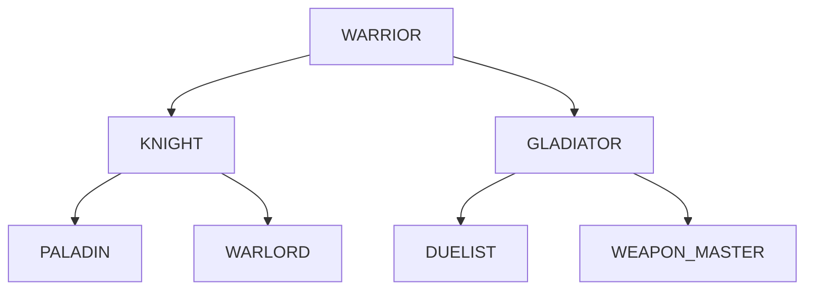

# RPG Game

基于 libGDX 开发的 RPG 游戏，实现了完整的游戏系统，包括战斗、存档、UI等功能。

## 目录

- [系统架构](#系统架构)
- [核心功能](#核心功能)
- [游戏特性](#游戏特性)
- [安装说明](#安装说明)
- [使用说明](#使用说明)
- [开发文档](#开发文档)
- [待改进](#待改进)
- [已知问题](#已知问题)

## 系统架构

### 技术栈
- Java 17
- libGDX 游戏框架
- Gradle (Kotlin DSL)

### 项目结构
```
core/                  # 游戏核心模块
├── src/main/java/    # 核心游戏逻辑
├── src/main/resources/ # 游戏资源
└── src/test/         # 单元测试

desktop/              # 桌面版本模块
└── src/             # 桌面特定代码
```

## 核心功能

### 1. 游戏系统
- 游戏状态管理
- 场景管理
- 资源管理
- 输入处理
- 音频管理

### 2. 战斗系统
- 回合制战斗
- 伤害计算
- 技能效果
- 战斗AI
- 战斗界面

### 3. 存档系统
- 多存档支持
- 自动存档
- 存档加密
- 存档读写

### 4. UI系统
- HUD界面
- 战斗界面
- 菜单界面
- 对话界面
- 物品栏

### 5. 地图系统
- 地图加载
- 地图切换
- 碰撞检测
- NPC交互

### 6. 实体系统
- 实体工厂
- 组件系统
- 状态管理
- 效果系统

### 7. 音频系统
- 音乐播放
- 音效管理
- 音量控制

## 游戏特性

### 职业系统
基础职业可以进化，每个职业有2个进阶方向：


### 战斗系统
- 基础攻击
- 物品使用
- HP/MP管理
- 等级提升
- 属性加点

### 物品系统
- 物品拖放
- 装备系统
- 消耗品使用
- 物品分类

### 任务系统
- 任务追踪
- 任务奖励
- 任务对话
- 任务进度

## 安装说明

1. 环境要求
   - Java 17+
   - Gradle 7.0+

2. 构建步骤
```bash
./gradlew desktop:dist
```

3. 运行游戏
```bash
java -jar desktop/build/libs/desktop-1.0.jar
```

## 使用说明

### 基本操作
- WASD：移动
- E：交互
- I：物品栏
- O：选项
- ESC：暂停/菜单

### 战斗操作
- 左键：选择目标
- 右键：取消
- 1-9：技能快捷键

### 界面操作
- 拖放：物品管理
- 双击：使用物品
- 右键：查看详情

## 开发文档

### 设计模式
1. 抽象工厂模式
   - 实体创建
   - 地图生成
   
2. 装饰器模式
   - 效果系统
   - 装备强化

3. 代理模式
   - 资源加载
   - 音频管理

4. 观察者模式
   - 事件系统
   - 状态更新

5. 组合模式
   - UI组件
   - 实体组件

6. 状态模式
   - 游戏状态
   - 实体状态

### 系统扩展
1. 添加新职业
2. 添加新地图
3. 添加新物品
4. 添加新技能
5. 添加新任务

## 待改进

- [ ] 音效系统完善
- [ ] 战斗动画优化
- [ ] AI行为增强
- [ ] 制作系统
- [ ] 更多过场效果
- [ ] 深度排序优化
- [ ] 碰撞系统完善
- [ ] 地图动画

## 已知问题

- 物品堆叠问题
- 菜单切换特效
- 拖拽选择偏移
- HP/MP显示间隔
- 退出位置重置
# GdxGame


## Description
<p>This project is based on https://github.com/patrickhoey/BludBourne using LibGDX library.<br>
It is an RPG 2D base game.</p>

#### Map
<p>The maps are from the Sword of Mana game (GBA) and influenced by the seiken densetsu serie. <br>
The edition was made with Tiled.exe in order to build layers.
</p>

#### Entities
- The hero is an animated 2D sprite. <br>
  The hero moves freely in the maps with the arrow keys or with "WASD". <br>
  The hero will soon be able to interact with NPCs with the "E" key.
- NPCs are also animated 2D sprites. <br>
  You can interact with them by clicking on them at a proper distance. Some have conversations and quests.

#### Battle Screen
The battle system is a turn based fight. <br>
The screen displays the amount of damage taken and inflicted by the player. <br>
For now, you can do a basic attack and use objects to restore your health and magic. Later you will be able to choose between a various set of attacks. <br>

#### Option Screen
The option screen is divided into 3 buttons : <br>
- The music settings (music is ok / sound is not implemented yet) <br>
- The control settings <br>
- A back input, so we can return to the previous screen <br>

The option screen is triggered on the "O" key.

#### Inventory
The inventory can be displayed through the chest icon on the status UI. <br>
You can drag and drop items and use consumables by double-clicking on them.

#### Level Up
When you level up (battle, quest), you will be able to display some more extra points to your base stats. <br>

#### Profiles
The game is saved automatically when a specific action is down (change map, get quest, ...). <br>
You can chose to start a new game or load an existing profile on the menu screen.

#### Class system
Base class can evolve if you meet the requirements. Each class can upgrade into 2 different classes, which themselves give 2 possible classes <br>
Upgrading class will grant you different bonuses, from bonus on character stats to weapons stats. <br>
Example of the class tree system for the warrior :


-------
## Demo
<p style="text-align:center">
  
</p>
<p style="text-align:center">gameplay demo</p>
<p style="text-align:center">
  
</p>
<p style="text-align:center">battle demo</p>
<p style="text-align:center">
  
  
</p>
<p style="text-align:center">demo with the new DA (can't show it on a public repo)</p>

-------
## Game idea
- [ ] add sounds & sounds settings

- [x] battle feature
   - [ ] entities' animation while attacking
   - [ ] ultimate attack cutscene
   - [ ] implement bonus gained by class
   - [ ] implement magic, resist, ... stats

- [ ] crafting feature

- [ ] credits

- [ ] improve AI

-------
## Bugs

- Objects in inventory are stacking even if there are not the same
- FadeIn effect not working when transition [menu &#8594; game]
- Drag and drop selection issue on item's render (items are far from mouse when picking them)
- Sometimes current hp/mp on status HUD add a blank space before the max player's hp/mp

&#8855; _Reset position when exiting the game is not properly set when you close the game with the X window button (it is fine when exiting with the ESCAPE key)_

-------
## To improve

- More transition effect
- Z sorting
- Improve collision with Box2D
- Animations on map (opening doors, water, ...)
