# 设计模式重构实现

## 目录

### 一、抽象工厂模式
1.1 [重构目标](#11-重构目标)
1.2 [重构前的问题](#12-重构前的问题)
1.3 [重构方案](#13-重构方案)
1.4 [重构后的改进](#14-重构后的改进)
1.5 [使用示例](#15-使用示例)
1.6 [UML类图](#16-uml类图)
1.7 [实现注意事项与优化](#17-实现注意事项与优化)

### 二、装饰器模式
2.1 [重构目标](#21-重构目标)
2.2 [重构前的问题](#22-重构前的问题)
2.3 [重构方案](#23-重构方案)
2.4 [重构后的改进](#24-重构后的改进)
2.5 [使用示例](#25-使用示例)
2.6 [UML类图](#26-uml类图)
2.7 [效果优先级系统](#27-效果优先级系统)
2.8 [效果处理流程](#28-效果处理流程)
2.9 [实现注意事项](#29-实现注意事项)

### 三、代理模式
3.1 [重构目标](#31-重构目标)
3.2 [重构前的问题](#32-重构前的问题)
3.3 [重构方案](#33-重构方案)
3.4 [重构后的改进](#34-重构后的改进)
3.5 [使用示例](#35-使用示例)
3.6 [UML类图](#36-uml类图)
3.7 [实现注意事项与优化](#37-实现注意事项与优化)

### 四、观察者模式
4.1 [重构目标](#41-重构目标)
4.2 [重构前的问题](#42-重构前的问题)
4.3 [重构方案](#43-重构方案)
4.4 [重构后的改进](#44-重构后的改进)
4.5 [使用示例](#45-使用示例)
4.6 [UML类图](#46-uml类图)
4.7 [实现注意事项与优化](#47-实现注意事项与优化)

### 五、状态模式
5.1 [重构目标](#51-重构目标)
5.2 [重构前的问题](#52-重构前的问题)
5.3 [重构方案](#53-重构方案)
5.4 [重构后的改进](#54-重构后的改进)
5.5 [使用示例](#55-使用示例)
5.6 [UML类图](#56-uml类图)
5.7 [状态转换图](#57-状态转换图)
5.8 [实现注意事项与优化](#58-实现注意事项与优化)

### 六、组合实体模式
6.1 [重构目标](#61-重构目标)
6.2 [重构前的问题](#62-重构前的问题)
6.3 [重构方案](#63-重构方案)
6.4 [重构后的改进](#64-重构后的改进)
6.5 [使用示例](#65-使用示例)
6.6 [UML类图](#66-uml类图)
6.7 [实现注意事项与优化](#67-实现注意事项与优化)

### 七、设计模式之间的协作
7.1 [协作关系](#71-协作关系)
7.2 [优点](#72-优点)
7.3 [注意事项](#73-注意事项)
7.4 [设计模式交互图](#74-设计模式交互图)
7.5 [具体协作场景示例](#75-具体协作场景示例)
7.6 [模式交互时序图](#76-模式交互时序图)
7.7 [性能优化建议](#77-性能优化建议)
7.8 [模式协作最佳实践](#78-模式协作最佳实践)

## 一、抽象工厂模式

### 1.1 重构目标
- 重构实体创建系统,使用抽象工厂模式来创建不同类型的实体及其组件
- 将实体创建的逻辑与具体实体类解耦
- 使实体创建过程更加灵活和可扩展
- 统一不同类型实体的创建接口
- 便于添加新的实体类型

### 1.2 重构前的问题
- 实体创建逻辑集中在EntityFactory类中,导致该类职责过重
- 实体组件的创建与实体类型强耦合
- 添加新实体类型需要修改EntityFactory类,违反开闭原则
- 实体配置与实体创建逻辑混合在一起

### 1.3 重构方案

#### 1.3.1 创建抽象工厂接口
```java
public interface EntityComponentFactory {
    InputComponent createInputComponent();
    PhysicsComponent createPhysicsComponent();
    GraphicsComponent createGraphicsComponent();
}
```

#### 1.3.2 为每种实体类型创建具体工厂
```java
// 玩家实体组件工厂
public class PlayerComponentFactory implements EntityComponentFactory {
    @Override
    public InputComponent createInputComponent() {
        return new PlayerInputComponent();
    }

    @Override
    public PhysicsComponent createPhysicsComponent() {
        return new PlayerPhysicsComponent();
    }

    @Override
    public GraphicsComponent createGraphicsComponent() {
        return new PlayerGraphicsComponent();
    }
}

// NPC实体组件工厂
public class NPCComponentFactory implements EntityComponentFactory {
    @Override
    public InputComponent createInputComponent() {
        return new NPCInputComponent();
    }

    @Override
    public PhysicsComponent createPhysicsComponent() {
        return new NPCPhysicsComponent();
    }

    @Override
    public GraphicsComponent createGraphicsComponent() {
        return new NPCGraphicsComponent();
    }
}

// 敌人实体组件工厂
public class EnemyComponentFactory implements EntityComponentFactory {
    @Override
    public InputComponent createInputComponent() {
        return new NPCInputComponent();
    }

    @Override
    public PhysicsComponent createPhysicsComponent() {
        return new EnemyPhysicsComponent();
    }

    @Override
    public GraphicsComponent createGraphicsComponent() {
        return new NPCGraphicsComponent();
    }
}
```

#### 1.3.3 重构EntityFactory类
```java
public class EntityFactory {
    private static EntityFactory instance = null;
    private final Map<EntityType, EntityComponentFactory> componentFactories;
    private final Map<String, EntityConfig> entityConfigs;
    private final Json json;

    private EntityFactory() {
        componentFactories = new HashMap<>();
        entityConfigs = new HashMap<>();
        json = new Json();
        
        // 注册组件工厂
        componentFactories.put(EntityType.WARRIOR, new PlayerComponentFactory());
        componentFactories.put(EntityType.MAGE, new PlayerComponentFactory());
        componentFactories.put(EntityType.NPC, new NPCComponentFactory());
        componentFactories.put(EntityType.ENEMY, new EnemyComponentFactory());
        
        // 加载实体配置
        loadEntityConfigs();
    }

    public Entity getEntity(EntityType entityType) {
        EntityComponentFactory factory = componentFactories.get(entityType);
        if (factory == null) {
            throw new IllegalArgumentException("Unknown entity type: " + entityType);
        }

        // 使用工厂创建组件
        Entity entity = new Entity(
            factory.createInputComponent(),
            factory.createPhysicsComponent(),
            factory.createGraphicsComponent()
        );

        // 加载实体配置
        EntityConfig config = getEntityConfig(entityType);
        if (config != null) {
            entity.setEntityConfig(config);
            entity.sendMessage(Component.MESSAGE.LOAD_ANIMATIONS, json.toJson(config));
        }

        return entity;
    }
}
```

### 1.4 重构后的改进
1. **解耦**: 实体组件的创建与实体类型解耦,每种实体类型有自己的组件工厂
2. **可扩展**: 添加新的实体类型只需创建新的组件工厂并注册,无需修改现有代码
3. **职责明确**: 
   - EntityComponentFactory负责组件创建
   - EntityFactory负责组装实体和管理配置
4. **维护性提升**: 各个工厂类职责单一,便于维护和测试
5. **配置分离**: 实体配置的加载与组件创建分离

### 1.5 使用示例
```java
// 在地图中创建NPC
Entity innKeeper = EntityFactory.getInstance().getEntity(EntityType.NPC);
initSpecialEntityPosition(innKeeper);
mapEntities.add(innKeeper);

// 在地图中创建敌人
Entity enemy = EntityFactory.getInstance().getEntity(EntityType.ENEMY);
initSpecialEntityPosition(enemy);
mapEntities.add(enemy);
```

### 1.6 UML类图
```mermaid
classDiagram
    %% 工厂类
    class EntityFactory {
        -Map<EntityType, EntityComponentFactory> componentFactories
        -Map<String, EntityConfig> entityConfigs
        +getEntity(EntityType) Entity
        +getEntityByName(EntityName) Entity
    }

    %% 抽象工厂接口
    class EntityComponentFactory {
        <<interface>>
        +createInputComponent() InputComponent
        +createPhysicsComponent() PhysicsComponent
        +createGraphicsComponent() GraphicsComponent
    }

    %% 具体工厂类
    class PlayerComponentFactory {
        +createInputComponent() InputComponent
        +createPhysicsComponent() PhysicsComponent
        +createGraphicsComponent() GraphicsComponent
    }

    class NPCComponentFactory {
        +createInputComponent() InputComponent
        +createPhysicsComponent() PhysicsComponent
        +createGraphicsComponent() GraphicsComponent
    }

    class EnemyComponentFactory {
        +createInputComponent() InputComponent
        +createPhysicsComponent() PhysicsComponent
        +createGraphicsComponent() GraphicsComponent
    }

    %% 组件基类
    class Component {
        <<interface>>
        +initialize(Entity)
        +update(float)
        +dispose()
        +receiveMessage(MESSAGE, String)
    }

    class InputComponent {
        <<abstract>>
        +update(Entity, float)
    }

    class PhysicsComponent {
        <<abstract>>
        +update(Entity, MapManager, float)
    }

    class GraphicsComponent {
        <<abstract>>
        +update(Entity, MapManager, Batch, float)
    }

    %% 具体组件类
    class PlayerInputComponent {
        +update(Entity, float)
    }

    class PlayerPhysicsComponent {
        +update(Entity, MapManager, float)
    }

    class PlayerGraphicsComponent {
        +update(Entity, MapManager, Batch, float)
    }

    class NPCInputComponent {
        +update(Entity, float)
    }

    class NPCPhysicsComponent {
        +update(Entity, MapManager, float)
    }

    class NPCGraphicsComponent {
        +update(Entity, MapManager, Batch, float)
    }

    class EnemyInputComponent {
        +update(Entity, float)
    }

    class EnemyPhysicsComponent {
        +update(Entity, MapManager, float)
    }

    class EnemyGraphicsComponent {
        +update(Entity, MapManager, Batch, float)
    }

    %% 关系
    EntityFactory --> EntityComponentFactory
    PlayerComponentFactory ..|> EntityComponentFactory
    NPCComponentFactory ..|> EntityComponentFactory
    EnemyComponentFactory ..|> EntityComponentFactory

    Component <|-- InputComponent
    Component <|-- PhysicsComponent
    Component <|-- GraphicsComponent

    InputComponent <|-- PlayerInputComponent
    PhysicsComponent <|-- PlayerPhysicsComponent
    GraphicsComponent <|-- PlayerGraphicsComponent

    InputComponent <|-- NPCInputComponent
    PhysicsComponent <|-- NPCPhysicsComponent
    GraphicsComponent <|-- NPCGraphicsComponent

    InputComponent <|-- EnemyInputComponent
    PhysicsComponent <|-- EnemyPhysicsComponent
    GraphicsComponent <|-- EnemyGraphicsComponent

    PlayerComponentFactory ..> PlayerInputComponent
    PlayerComponentFactory ..> PlayerPhysicsComponent
    PlayerComponentFactory ..> PlayerGraphicsComponent

    NPCComponentFactory ..> NPCInputComponent
    NPCComponentFactory ..> NPCPhysicsComponent
    NPCComponentFactory ..> NPCGraphicsComponent

    EnemyComponentFactory ..> EnemyInputComponent
    EnemyComponentFactory ..> EnemyPhysicsComponent
    EnemyComponentFactory ..> EnemyGraphicsComponent
```

### 1.7 实现注意事项与优化
1. **实现注意事项**
   - 避免工厂类职责过重
   - 注意组件创建的顺序
   - 处理组件初始化失败

2. **性能优化**
   - 使用组件对象池
   - 延迟加载非关键组件
   - 缓存常用实体配置

3. **错误处理**
   - 组件创建失败的回滚机制
   - 配置加载异常处理
   - 实体初始化异常恢复

## 二、装饰器模式

### 2.1 重构目标
- 实现灵活的实体效果系统，支持动态添加和移除效果
- 允许效果的组合和叠加
- 保持效果之间的独立性
- 支持效果的优先级管理
- 便于添加新的效果类型

### 2.2 重构前的问题
- 效果系统与实体类强耦合
- 效果之间相互依赖，难以单独修改
- 添加新效果需要修改实体类代码
- 效果的组合方式不灵活
- 缺乏效果优先级管理机制

### 2.3 重构方案

#### 2.3.1 创建效果接口和基类
```java
public interface EntityEffect {
    void apply(Entity entity, float delta);
    boolean isFinished();
    float getRemainingTime();
    EffectPriority getPriority();
}

public abstract class BaseEntityEffect implements EntityEffect {
    protected float duration;
    protected float elapsedTime;
    protected float strength;
    protected EffectPriority priority;

    public BaseEntityEffect(float duration, float strength, EffectPriority priority) {
        this.duration = duration;
        this.strength = strength;
        this.priority = priority;
        this.elapsedTime = 0;
    }

    @Override
    public boolean isFinished() {
        return elapsedTime >= duration;
    }

    @Override
    public float getRemainingTime() {
        return Math.max(0, duration - elapsedTime);
    }

    @Override
    public EffectPriority getPriority() {
        return priority;
    }
}
```

#### 2.3.2 实现具体效果类
```java
public class PoisonEffect extends BaseEntityEffect {
    private float tickInterval;
    private float tickTimer;

    public PoisonEffect(float duration, float damagePerSecond, float tickInterval) {
        super(duration, damagePerSecond, EffectPriority.DAMAGE);
        this.tickInterval = tickInterval;
        this.tickTimer = 0;
    }

    @Override
    public void apply(Entity entity, float delta) {
        elapsedTime += delta;
        tickTimer += delta;
        
        if (tickTimer >= tickInterval) {
            float damage = strength * tickInterval;
            entity.takeDamage(damage);
            tickTimer = 0;
        }
    }
}

public class BurningEffect extends BaseEntityEffect implements DamageModifierEffect {
    private float attackPenalty;
    private float tickInterval;
    private float tickTimer;

    public BurningEffect(float duration, float damagePerSecond, float attackPenalty) {
        super(duration, damagePerSecond, EffectPriority.DAMAGE);
        this.attackPenalty = attackPenalty;
        this.tickInterval = 0.5f;
        this.tickTimer = 0;
    }

    @Override
    public void apply(Entity entity, float delta) {
        elapsedTime += delta;
        tickTimer += delta;
        
        if (tickTimer >= tickInterval) {
            float damage = strength * tickInterval;
            entity.takeDamage(damage);
            entity.addVisualEffect("burning");
            tickTimer = 0;
        }
    }

    @Override
    public float getDamageMultiplier() {
        return 1.0f - attackPenalty;
    }
}
```

#### 2.3.3 效果管理器实现
```java
public class EntityEffectManager {
    private Entity owner;
    private List<EntityEffect> activeEffects;
    private Map<Class<? extends EntityEffect>, EntityEffect> effectTypeMap;
    private Map<EffectPriority, List<EntityEffect>> priorityMap;

    public EntityEffectManager(Entity owner) {
        this.owner = owner;
        this.activeEffects = new ArrayList<>();
        this.effectTypeMap = new HashMap<>();
        this.priorityMap = new EnumMap<>(EffectPriority.class);
        for (EffectPriority priority : EffectPriority.values()) {
            priorityMap.put(priority, new ArrayList<>());
        }
    }

    public void addEffect(EntityEffect effect) {
        // 检查同类效果
        Class<? extends EntityEffect> effectClass = effect.getClass();
        EntityEffect existingEffect = effectTypeMap.get(effectClass);
        
        if (existingEffect != null) {
            // 根据策略处理重复效果
            handleDuplicateEffect(existingEffect, effect);
        } else {
            // 添加新效果
            activeEffects.add(effect);
            effectTypeMap.put(effectClass, effect);
            priorityMap.get(effect.getPriority()).add(effect);
        }
    }

    public void update(float delta) {
        Iterator<EntityEffect> iterator = activeEffects.iterator();
        while (iterator.hasNext()) {
            EntityEffect effect = iterator.next();
            effect.apply(owner, delta);
            
            if (effect.isFinished()) {
                removeEffect(effect);
                iterator.remove();
            }
        }
    }

    private void removeEffect(EntityEffect effect) {
        effectTypeMap.remove(effect.getClass());
        priorityMap.get(effect.getPriority()).remove(effect);
    }

    private void handleDuplicateEffect(EntityEffect existing, EntityEffect newEffect) {
        // 可以实现不同的重叠效果处理策略
        // 例如: 取最强效果、叠加效果、刷新持续时间等
    }
}
```

### 2.4 重构后的改进
1. **灵活性**: 可以动态添加和移除效果，支持效果组合
2. **可扩展**: 添加新效果只需实现EntityEffect接口
3. **解耦**: 效果逻辑与实体类完全分离
4. **可维护**: 每个效果独立封装，易于修改和测试
5. **性能优化**: 通过优先级系统管理效果更新顺序

### 2.5 使用示例
```java
// 创建效果
PoisonEffect poison = new PoisonEffect(10.0f, 5.0f, 1.0f);
BurningEffect burning = new BurningEffect(5.0f, 3.0f, 0.2f);

// 应用效果
entity.getEffectManager().addEffect(poison);
entity.getEffectManager().addEffect(burning);

// 在实体更新循环中
effectManager.update(deltaTime);
```

### 2.6 UML类图
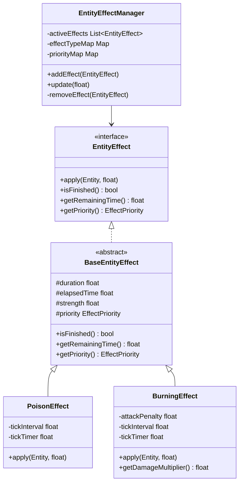

### 2.7 效果优先级系统
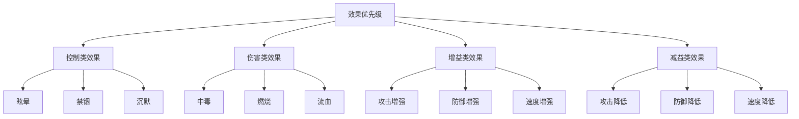

### 2.8 效果处理流程
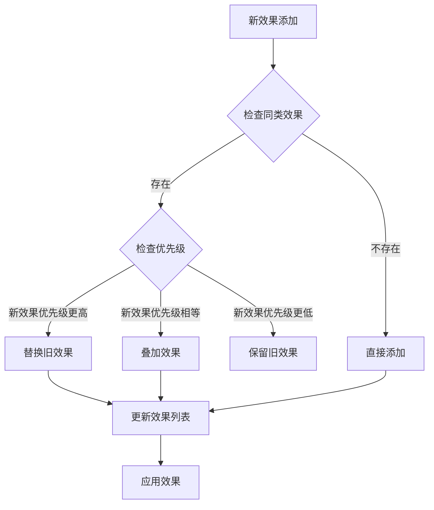

### 2.9 实现注意事项
1. **效果优先级管理**
   - 使用枚举定义明确的优先级等级
   - 控制类效果优先级最高
   - 同类效果考虑叠加规则

2. **性能优化**
   - 使用对象池复用效果实例
   - 批量处理效果更新
   - 及时清理失效效果

3. **错误处理**
   - 处理效果应用失败的情况
   - 实现效果回滚机制
   - 记录效果应用日志

## 三、代理模式

### 3.1 重构目标
- 实现资源的延迟加载机制
- 优化内存使用，避免不必要的资源加载
- 统一资源访问接口
- 提供资源生命周期管理
- 支持资源缓存和预加载

### 3.2 重构前的问题
- 资源加载时机不合理，占用过多内存
- 缺乏统一的资源管理机制
- 资源加载状态难以追踪
- 资源释放不及时，造成内存泄漏
- 缺乏资源加载错误处理

### 3.3 重构方案

#### 3.3.1 定义资源接口
```java
public interface GameResource {
    void load();
    void unload();
    boolean isLoaded();
    String getResourcePath();
}

public interface ResourceManager {
    void preloadResource(String path);
    GameResource getResource(String path);
    void releaseResource(String path);
    void releaseAll();
}
```

#### 3.3.2 实现资源代理类
```java
public class TextureResourceProxy implements GameResource {
    private TextureResource realResource;
    private String resourcePath;
    private boolean isLoading;
    private List<ResourceLoadListener> loadListeners;

    public TextureResourceProxy(String path) {
        this.resourcePath = path;
        this.loadListeners = new ArrayList<>();
        this.isLoading = false;
    }

    @Override
    public void load() {
        if (realResource == null && !isLoading) {
            isLoading = true;
            try {
                realResource = new TextureResource(resourcePath);
                realResource.load();
                notifyLoadComplete();
            } catch (Exception e) {
                notifyLoadError(e);
            } finally {
                isLoading = false;
            }
        }
    }

    @Override
    public void unload() {
        if (realResource != null) {
            realResource.unload();
            realResource = null;
        }
    }

    @Override
    public boolean isLoaded() {
        return realResource != null && realResource.isLoaded();
    }

    public void addLoadListener(ResourceLoadListener listener) {
        loadListeners.add(listener);
    }

    private void notifyLoadComplete() {
        for (ResourceLoadListener listener : loadListeners) {
            listener.onLoadComplete(this);
        }
    }

    private void notifyLoadError(Exception e) {
        for (ResourceLoadListener listener : loadListeners) {
            listener.onLoadError(this, e);
        }
    }
}
```

#### 3.3.3 资源管理器实现
```java
public class GameResourceManager implements ResourceManager {
    private Map<String, GameResource> resources;
    private Map<String, List<GameResource>> dependencies;
    private ExecutorService loadingExecutor;

    public GameResourceManager() {
        this.resources = new ConcurrentHashMap<>();
        this.dependencies = new ConcurrentHashMap<>();
        this.loadingExecutor = Executors.newFixedThreadPool(2);
    }

    @Override
    public void preloadResource(String path) {
        if (!resources.containsKey(path)) {
            GameResource resource = createResource(path);
            resources.put(path, resource);
            loadingExecutor.submit(() -> resource.load());
        }
    }

    @Override
    public GameResource getResource(String path) {
        GameResource resource = resources.get(path);
        if (resource == null) {
            resource = createResource(path);
            resources.put(path, resource);
            resource.load(); // 同步加载
        }
        return resource;
    }

    @Override
    public void releaseResource(String path) {
        GameResource resource = resources.remove(path);
        if (resource != null) {
            resource.unload();
        }
    }

    private GameResource createResource(String path) {
        // 根据资源类型创建适当的代理
        if (path.endsWith(".png") || path.endsWith(".jpg")) {
            return new TextureResourceProxy(path);
        } else if (path.endsWith(".wav") || path.endsWith(".mp3")) {
            return new AudioResourceProxy(path);
        }
        throw new IllegalArgumentException("Unsupported resource type: " + path);
    }
}
```

### 3.4 重构后的改进
1. **内存优化**: 资源按需加载，及时释放
2. **性能提升**: 支持资源预加载和异步加载
3. **错误处理**: 完善的资源加载错误处理机制
4. **可维护性**: 统一的资源管理接口，便于维护
5. **扩展性**: 易于添加新的资源类型支持

### 3.5 使用示例
```java
// 预加载资源
resourceManager.preloadResource("textures/player.png");

// 获取资源
GameResource resource = resourceManager.getResource("textures/player.png");
if (resource.isLoaded()) {
    // 使用资源
}

// 释放资源
resourceManager.releaseResource("textures/player.png");
```

### 3.6 UML类图
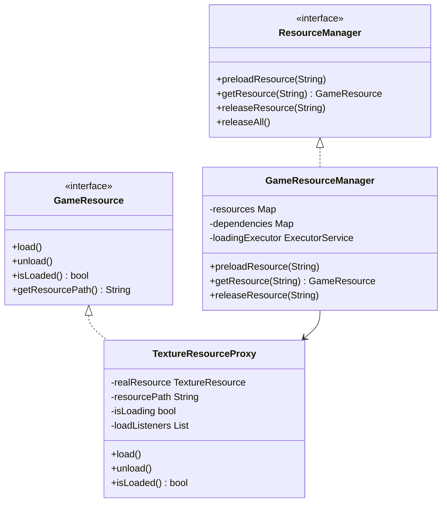

## 四、观察者模式

### 4.1 重构目标
- 实现实体状态变化的自动通知机制
- 降低系统组件间的耦合度
- 支持动态添加和移除观察者
- 实现事件的优先级处理
- 提供灵活的事件分发机制

### 4.2 重构前的问题
- 状态变化通知逻辑分散在各处
- 组件之间存在强耦合
- 事件处理缺乏统一管理
- 难以动态调整事件监听
- 缺乏事件优先级机制

### 4.3 重构方案

#### 4.3.1 定义事件和观察者接口
```java
public interface EntityEvent {
    Entity getSource();
    EventType getType();
    Map<String, Object> getParameters();
}

public interface EntityObserver {
    void onEvent(EntityEvent event);
    int getPriority();
}

public enum EventType {
    HEALTH_CHANGED,
    STATE_CHANGED,
    POSITION_CHANGED,
    ATTACK_PERFORMED,
    DAMAGE_TAKEN,
    EFFECT_APPLIED,
    EFFECT_REMOVED
}
```

#### 4.3.2 实现具体事件类
```java
public class HealthChangeEvent implements EntityEvent {
    private Entity source;
    private float oldHealth;
    private float newHealth;
    private Map<String, Object> parameters;

    public HealthChangeEvent(Entity source, float oldHealth, float newHealth) {
        this.source = source;
        this.oldHealth = oldHealth;
        this.newHealth = newHealth;
        this.parameters = new HashMap<>();
        parameters.put("oldHealth", oldHealth);
        parameters.put("newHealth", newHealth);
    }

    @Override
    public Entity getSource() {
        return source;
    }

    @Override
    public EventType getType() {
        return EventType.HEALTH_CHANGED;
    }

    @Override
    public Map<String, Object> getParameters() {
        return Collections.unmodifiableMap(parameters);
    }
}
```

#### 4.3.3 事件管理器实现
```java
public class EntityEventManager {
    private Map<EventType, List<EntityObserver>> observers;
    private Queue<EntityEvent> eventQueue;
    private boolean isProcessingEvents;

    public EntityEventManager() {
        this.observers = new EnumMap<>(EventType.class);
        this.eventQueue = new ConcurrentLinkedQueue<>();
        this.isProcessingEvents = false;

        for (EventType type : EventType.values()) {
            observers.put(type, new ArrayList<>());
        }
    }

    public void addObserver(EventType type, EntityObserver observer) {
        List<EntityObserver> typeObservers = observers.get(type);
        if (!typeObservers.contains(observer)) {
            typeObservers.add(observer);
            // 按优先级排序
            typeObservers.sort((o1, o2) -> o2.getPriority() - o1.getPriority());
        }
    }

    public void removeObserver(EventType type, EntityObserver observer) {
        observers.get(type).remove(observer);
    }

    public void dispatchEvent(EntityEvent event) {
        eventQueue.offer(event);
        if (!isProcessingEvents) {
            processEvents();
        }
    }

    private void processEvents() {
        isProcessingEvents = true;
        EntityEvent event;
        while ((event = eventQueue.poll()) != null) {
            List<EntityObserver> typeObservers = observers.get(event.getType());
            for (EntityObserver observer : typeObservers) {
                try {
                    observer.onEvent(event);
                } catch (Exception e) {
                    // 处理观察者异常
                    handleObserverException(observer, event, e);
                }
            }
        }
        isProcessingEvents = false;
    }
}
```

### 4.4 重构后的改进
1. **解耦**: 实现了状态变化的松耦合通知
2. **可扩展**: 易于添加新的事件类型和观察者
3. **可维护**: 集中管理事件分发逻辑
4. **健壮性**: 完善的异常处理机制
5. **灵活性**: 支持动态添加和移除观察者

### 4.5 使用示例
```java
// 创建观察者
EntityObserver healthObserver = new EntityObserver() {
    @Override
    public void onEvent(EntityEvent event) {
        if (event instanceof HealthChangeEvent) {
            // 处理生命值变化
            updateHealthUI(event.getParameters());
        }
    }

    @Override
    public int getPriority() {
        return 1;
    }
};

// 注册观察者
eventManager.addObserver(EventType.HEALTH_CHANGED, healthObserver);

// 触发事件
entity.takeDamage(10);  // 内部会创建并分发HealthChangeEvent
```

### 4.6 UML类图
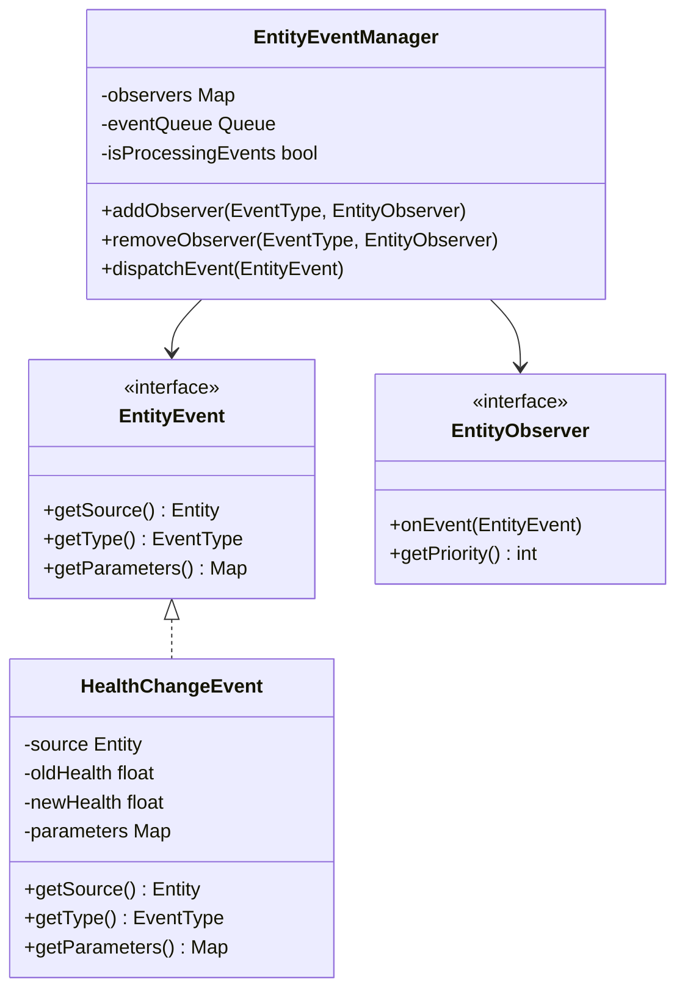

## 五、状态模式

### 5.1 重构目标
- 实现清晰的实体状态管理
- 支持复杂的状态转换逻辑
- 分离状态相关的行为
- 便于添加新状态
- 支持状态的嵌套和组合

### 5.2 重构前的问题
- 状态逻辑使用if-else实现，代码复杂
- 状态转换逻辑分散，难以维护
- 状态相关行为与实体类耦合
- 难以添加新状态
- 状态组合实现复杂

### 5.3 重构方案

#### 5.3.1 定义状态接口和状态机
```java
public interface EntityState {
    void enter(Entity entity);
    void update(Entity entity, float delta);
    void exit(Entity entity);
    boolean handleMessage(Entity entity, ComponentMessage message);
}

public class EntityStateMachine {
    private Entity owner;
    private EntityState currentState;
    private EntityState previousState;
    private Map<String, EntityState> states;
    private Stack<EntityState> stateStack;

    public EntityStateMachine(Entity owner) {
        this.owner = owner;
        this.states = new HashMap<>();
        this.stateStack = new Stack<>();
    }

    public void addState(String name, EntityState state) {
        states.put(name, state);
    }

    public void changeState(String stateName) {
        EntityState newState = states.get(stateName);
        if (newState != null && newState != currentState) {
            if (currentState != null) {
                currentState.exit(owner);
            }
            previousState = currentState;
            currentState = newState;
            currentState.enter(owner);
        }
    }

    public void pushState(String stateName) {
        EntityState newState = states.get(stateName);
        if (newState != null) {
            if (currentState != null) {
                stateStack.push(currentState);
            }
            currentState = newState;
            currentState.enter(owner);
        }
    }

    public void popState() {
        if (currentState != null) {
            currentState.exit(owner);
        }
        if (!stateStack.isEmpty()) {
            currentState = stateStack.pop();
            currentState.enter(owner);
        }
    }

    public void update(float delta) {
        if (currentState != null) {
            currentState.update(owner, delta);
        }
    }

    public boolean handleMessage(ComponentMessage message) {
        return currentState != null && currentState.handleMessage(owner, message);
    }
}
```

#### 5.3.2 实现具体状态类
```java
public class IdleState implements EntityState {
    @Override
    public void enter(Entity entity) {
        entity.setAnimation("idle");
    }

    @Override
    public void update(Entity entity, float delta) {
        // 检查是否应该转换到其他状态
        checkStateTransitions(entity);
    }

    @Override
    public void exit(Entity entity) {
        // 清理状态
    }

    @Override
    public boolean handleMessage(Entity entity, ComponentMessage message) {
        // 处理消息
        return false;
    }
}

public class CombatState implements EntityState {
    private float attackCooldown;
    private float currentCooldown;

    @Override
    public void enter(Entity entity) {
        entity.setAnimation("combat_ready");
        attackCooldown = 1.0f;
        currentCooldown = 0;
    }

    @Override
    public void update(Entity entity, float delta) {
        updateCooldowns(delta);
        checkForTargets(entity);
        performCombatActions(entity);
    }

    private void updateCooldowns(float delta) {
        if (currentCooldown > 0) {
            currentCooldown -= delta;
        }
    }
}

public class StunnedState implements EntityState {
    private float duration;
    private float remainingTime;

    public StunnedState(float duration) {
        this.duration = duration;
    }

    @Override
    public void enter(Entity entity) {
        entity.setAnimation("stunned");
        remainingTime = duration;
        entity.setMovementLocked(true);
    }

    @Override
    public void update(Entity entity, float delta) {
        remainingTime -= delta;
        if (remainingTime <= 0) {
            entity.getStateMachine().changeState("idle");
        }
    }

    @Override
    public void exit(Entity entity) {
        entity.setMovementLocked(false);
    }
}
```

#### 5.3.3 状态工厂实现
```java
public class EntityStateFactory {
    private Map<String, Supplier<EntityState>> stateCreators;

    public EntityStateFactory() {
        stateCreators = new HashMap<>();
        registerDefaultStates();
    }

    private void registerDefaultStates() {
        stateCreators.put("idle", IdleState::new);
        stateCreators.put("combat", CombatState::new);
        stateCreators.put("stunned", () -> new StunnedState(2.0f));
        stateCreators.put("moving", MovingState::new);
    }

    public EntityState createState(String stateName) {
        Supplier<EntityState> creator = stateCreators.get(stateName);
        if (creator != null) {
            return creator.get();
        }
        throw new IllegalArgumentException("Unknown state: " + stateName);
    }
}
```

### 5.4 重构后的改进
1. **清晰性**: 状态逻辑清晰分离
2. **可维护**: 每个状态独立维护，易于修改
3. **可扩展**: 轻松添加新状态
4. **解耦**: 状态行为与实体类分离
5. **灵活**: 支持状态的嵌套和组合

### 5.5 使用示例
```java
// 创建状态机
EntityStateMachine stateMachine = new EntityStateMachine(entity);

// 添加状态
stateMachine.addState("idle", new IdleState());
stateMachine.addState("combat", new CombatState());
stateMachine.addState("stunned", new StunnedState(2.0f));

// 设置初始状态
stateMachine.changeState("idle");

// 在实体更新中
stateMachine.update(deltaTime);

// 状态转换
if (enemyNearby) {
    stateMachine.changeState("combat");
}
```

### 5.6 UML类图
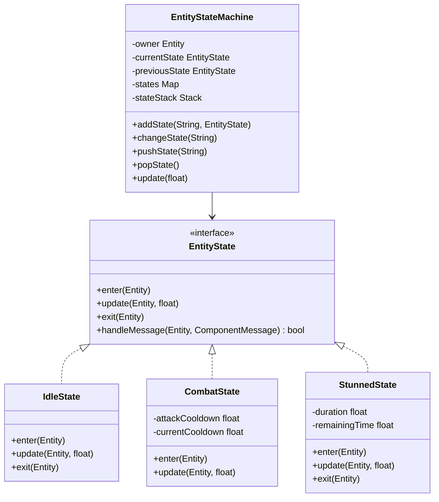

### 5.7 状态转换图
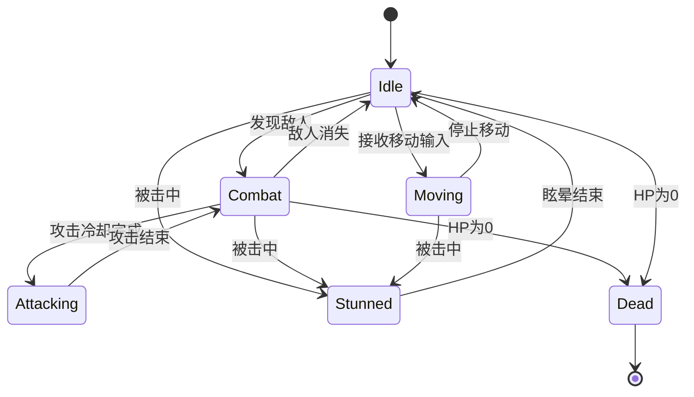

### 5.8 实现注意事项与优化
1. **实现注意事项**
   - 避免状态爆炸
   - 控制状态转换复杂度
   - 处理状态栈溢出

2. **性能优化**
   - 状态对象复用
   - 优化状态检查
   - 减少不必要的状态切换

3. **错误处理**
   - 状态转换失败恢复
   - 非法状态检测
   - 状态栈错误处理

## 六、组合实体模式

### 6.1 重构目标
- 实现灵活的实体组件系统
- 支持组件的动态添加和移除
- 提供组件间的通信机制
- 实现组件的生命周期管理
- 支持组件的依赖关系处理

### 6.2 重构前的问题
- 实体功能通过继承实现，导致类层次复杂
- 组件之间耦合度高
- 难以复用和组合功能
- 缺乏统一的组件管理机制
- 组件间通信方式不统一

### 6.3 重构方案

#### 6.3.1 定义组件接口和消息系统
```java
public interface Component {
    void initialize(Entity owner);
    void update(float delta);
    void dispose();
    boolean handleMessage(ComponentMessage message);
}

public class ComponentMessage {
    private String type;
    private Map<String, Object> parameters;

    public ComponentMessage(String type) {
        this.type = type;
        this.parameters = new HashMap<>();
    }

    public void setParameter(String key, Object value) {
        parameters.put(key, value);
    }

    public Object getParameter(String key) {
        return parameters.get(key);
    }
}
```

#### 6.3.2 实现组合实体
```java
public class CompositeEntity implements Entity {
    private Map<Class<? extends Component>, Component> components;
    private List<Component> updateOrder;
    private boolean initialized;
    private EntityManager entityManager;

    public CompositeEntity(EntityManager entityManager) {
        this.components = new HashMap<>();
        this.updateOrder = new ArrayList<>();
        this.initialized = false;
        this.entityManager = entityManager;
    }

    public <T extends Component> void addComponent(T component) {
        Class<? extends Component> componentClass = component.getClass();
        if (!components.containsKey(componentClass)) {
            components.put(componentClass, component);
            updateOrder.add(component);
            if (initialized) {
                component.initialize(this);
            }
        }
    }

    public <T extends Component> T getComponent(Class<T> componentClass) {
        return componentClass.cast(components.get(componentClass));
    }

    public void initialize() {
        if (!initialized) {
            for (Component component : updateOrder) {
                component.initialize(this);
            }
            initialized = true;
        }
    }

    public void update(float delta) {
        for (Component component : updateOrder) {
            component.update(delta);
        }
    }

    public void dispose() {
        for (Component component : updateOrder) {
            component.dispose();
        }
        components.clear();
        updateOrder.clear();
    }

    public boolean sendMessage(ComponentMessage message) {
        boolean handled = false;
        for (Component component : updateOrder) {
            if (component.handleMessage(message)) {
                handled = true;
            }
        }
        return handled;
    }
}
```

#### 6.3.3 实现具体组件
```java
public class HealthComponent implements Component {
    private Entity owner;
    private float maxHealth;
    private float currentHealth;
    private List<StatusEffect> statusEffects;

    @Override
    public void initialize(Entity owner) {
        this.owner = owner;
        this.statusEffects = new ArrayList<>();
    }

    @Override
    public void update(float delta) {
        updateStatusEffects(delta);
    }

    @Override
    public boolean handleMessage(ComponentMessage message) {
        switch (message.getType()) {
            case "DAMAGE":
                float damage = (float) message.getParameter("amount");
                takeDamage(damage);
                return true;
            case "HEAL":
                float healing = (float) message.getParameter("amount");
                heal(healing);
                return true;
            default:
                return false;
        }
    }
}

public class MovementComponent implements Component {
    private Entity owner;
    private Vector2 position;
    private Vector2 velocity;
    private float maxSpeed;

    @Override
    public void update(float delta) {
        updatePosition(delta);
        handleCollisions();
    }

    @Override
    public boolean handleMessage(ComponentMessage message) {
        switch (message.getType()) {
            case "MOVE":
                Vector2 direction = (Vector2) message.getParameter("direction");
                move(direction);
                return true;
            case "TELEPORT":
                Vector2 position = (Vector2) message.getParameter("position");
                teleport(position);
                return true;
            default:
                return false;
        }
    }
}
```

### 6.4 重构后的改进
1. **灵活性**: 通过组合而非继承实现功能
2. **可重用**: 组件可以在不同实体间复用
3. **可维护**: 每个组件职责单一，易于维护
4. **可扩展**: 易于添加新组件和功能
5. **解耦**: 组件之间通过消息系统通信，降低耦合

### 6.5 使用示例
```java
// 创建实体
CompositeEntity player = new CompositeEntity(entityManager);

// 添加组件
player.addComponent(new HealthComponent());
player.addComponent(new MovementComponent());
player.addComponent(new CombatComponent());

// 初始化实体
player.initialize();

// 发送消息给组件
ComponentMessage damageMsg = new ComponentMessage("DAMAGE");
damageMsg.setParameter("amount", 10.0f);
player.sendMessage(damageMsg);
```

### 6.6 UML类图
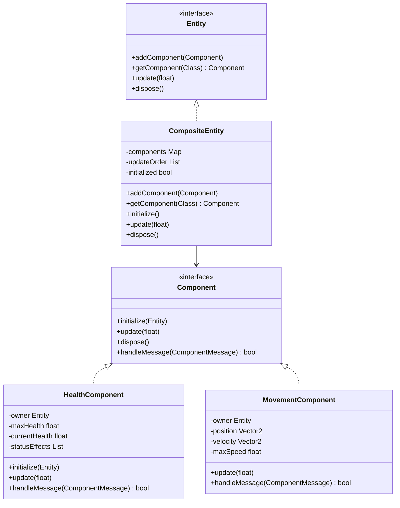

## 七、设计模式之间的协作

### 7.1 协作关系
这六个设计模式共同工作，形成了一个灵活且可扩展的游戏实体系统：

1. **抽象工厂模式**负责创建不同类型的实体
2. **装饰器模式**负责动态添加临时效果
3. **代理模式**确保资源按需加载
4. **观察者模式**实现状态变化的自动通知
5. **状态模式**管理实体的状态转换
6. **组合实体模式**提供灵活的实体构建方式

### 7.2 优点
1. 高度模块化
2. 易于扩展
3. 代码复用
4. 低耦合度
5. 清晰的职责划分

### 7.3 注意事项
1. 合理使用消息系统进行组件间通信
2. 注意资源的及时释放
3. 避免组件之间的循环依赖
4. 保持组件的独立性
5. 注意状态转换的性能开销
6. 控制装饰器链的长度 

### 7.4 设计模式交互图
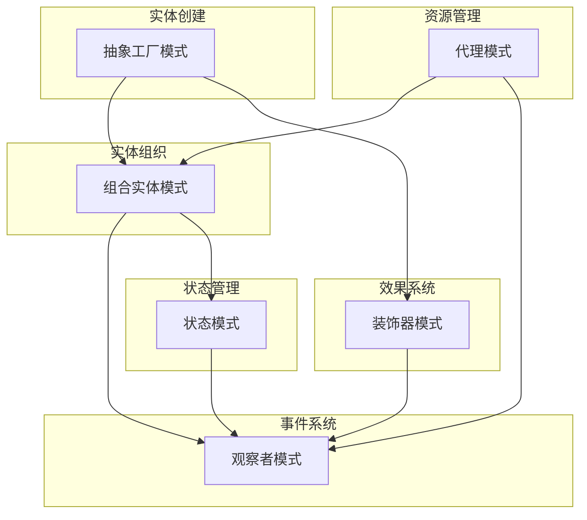

### 7.5 具体协作场景示例

#### 7.5.1 玩家角色创建与状态变化
```java
// 1. 使用抽象工厂创建玩家实体
Entity player = EntityFactory.getInstance().getEntity(EntityType.PLAYER);

// 2. 通过组合模式添加组件
player.addComponent(new HealthComponent());
player.addComponent(new CombatComponent());

// 3. 使用观察者模式监听状态
player.getEventManager().addObserver(EventType.STATE_CHANGED, (event) -> {
    // 处理状态变化
    updatePlayerUI(event);
});

// 4. 使用状态模式管理玩家状态
player.getStateMachine().changeState("combat");

// 5. 使用装饰器模式添加临时效果
player.getEffectManager().addEffect(new PowerUpEffect(30.0f));
```

#### 7.5.2 资源加载与状态管理
```java
// 1. 使用代理模式延迟加载资源
TextureResourceProxy texture = new TextureResourceProxy("player.png");
texture.addLoadListener(new ResourceLoadListener() {
    @Override
    public void onLoadComplete(GameResource resource) {
        // 2. 使用观察者模式通知加载完成
        eventManager.dispatchEvent(new ResourceLoadEvent(resource));
    }
});

// 3. 状态模式处理加载状态
gameStateMachine.changeState("loading");
// 资源加载完成后
gameStateMachine.changeState("playing");
```

### 7.6 模式交互时序图

#### 7.6.1 战斗系统时序图
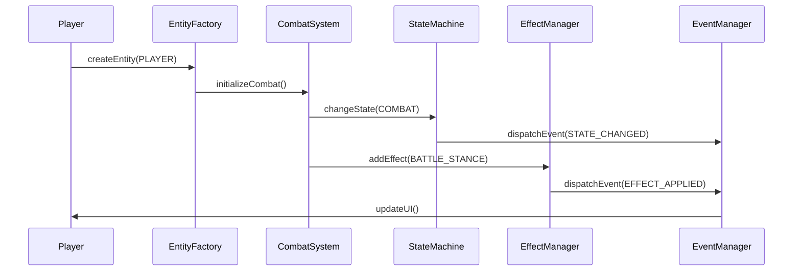

#### 7.6.2 资源加载时序图
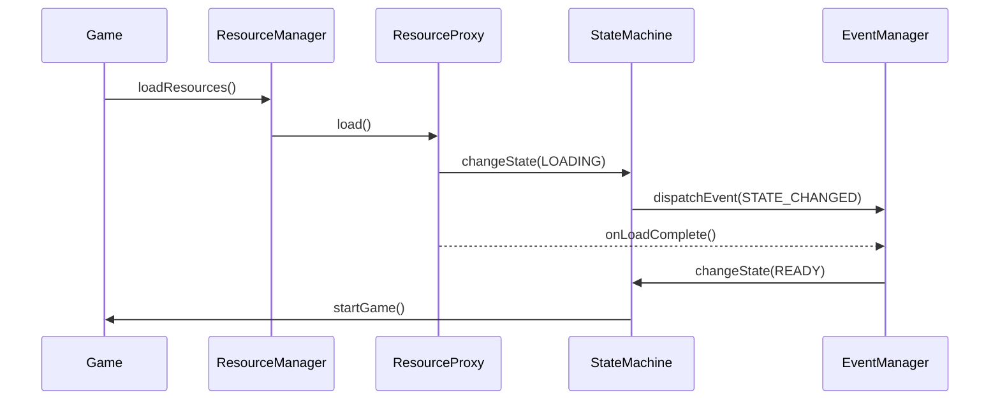

### 7.7 性能优化建议

#### 7.7.1 模式组合性能考虑
1. **事件系统优化**
   - 使用事件对象池减少垃圾回收
   - 实现事件批处理机制
   - 优化事件分发算法
```java
public class EventPool {
    private static final int MAX_POOL_SIZE = 100;
    private Queue<EntityEvent> eventPool;
    
    public EntityEvent obtain(EventType type) {
        EntityEvent event = eventPool.poll();
        return event != null ? event : new EntityEvent(type);
    }
    
    public void free(EntityEvent event) {
        if (eventPool.size() < MAX_POOL_SIZE) {
            event.reset();
            eventPool.offer(event);
        }
    }
}
```

2. **状态转换优化**
   - 缓存常用状态对象
   - 优化状态检查逻辑
   - 减少不必要的状态切换
```java
public class StateCache {
    private Map<String, EntityState> stateCache;
    
    public EntityState getState(String stateName) {
        return stateCache.computeIfAbsent(stateName, 
            name -> createState(name));
    }
}
```

3. **组件系统优化**
   - 实现组件更新排序
   - 使用组件对象池
   - 优化组件消息传递
```java
public class ComponentUpdateManager {
    private List<List<Component>> updateLayers;
    
    public void updateComponents(float delta) {
        for (List<Component> layer : updateLayers) {
            for (Component component : layer) {
                component.update(delta);
            }
        }
    }
}
```

#### 7.7.2 资源管理优化
1. **预加载策略**
   - 场景切换时预加载资源
   - 实现资源分级加载
   - 优化资源缓存策略
```java
public class ResourcePreloader {
    public void preloadScene(String sceneName) {
        List<String> resources = getSceneResources(sceneName);
        for (String resource : resources) {
            resourceManager.preload(resource, getPriority(resource));
        }
    }
}
```

2. **内存管理**
   - 实现资源自动卸载
   - 监控资源使用情况
   - 优化资源生命周期
```java
public class ResourceMonitor {
    public void monitorResourceUsage() {
        long usedMemory = getUsedMemory();
        if (usedMemory > MEMORY_THRESHOLD) {
            unloadUnusedResources();
        }
    }
}
```

#### 7.7.3 效果系统优化
1. **效果处理优化**
   - 实现效果批处理
   - 优化效果更新顺序
   - 使用效果对象池
```java
public class EffectBatchProcessor {
    private Map<EffectPriority, List<EntityEffect>> effectBatches;
    
    public void processEffects(float delta) {
        for (EffectPriority priority : EffectPriority.values()) {
            List<EntityEffect> effects = effectBatches.get(priority);
            processEffectBatch(effects, delta);
        }
    }
}
```

### 7.8 模式协作最佳实践

1. **模式选择原则**
   - 根据实际需求选择合适的模式组合
   - 避免过度设计
   - 保持模式使用的一致性

2. **协作规范**
   - 定义清晰的模式交互接口
   - 维护模式之间的依赖关系
   - 确保模式交互的可测试性

3. **扩展建议**
   - 预留模式扩展点
   - 制定模式版本升级策略
   - 保持文档的同步更新

