# 设计模式重构实现

## 目录

### 一、抽象工厂模式
1.1 [重构目标](#11-重构目标)
1.2 [重构前的问题](#12-重构前的问题)
1.3 [重构方案](#13-重构方案)
1.4 [重构后的改进](#14-重构后的改进)
1.5 [使用示例](#15-使用示例)
1.6 [UML类图](#16-uml类图)
1.7 [实现注意事项与优化](#17-实现注意事项与优化)

### 二、装饰器模式
2.1 [重构目标](#21-重构目标)
2.2 [重构前的问题](#22-重构前的问题)
2.3 [重构方案](#23-重构方案)
2.4 [重构后的改进](#24-重构后的改进)
2.5 [使用示例](#25-使用示例)
2.6 [UML类图](#26-uml类图)
2.7 [效果优先级系统](#27-效果优先级系统)
2.8 [效果处理流程](#28-效果处理流程)
2.9 [实现注意事项](#29-实现注意事项)

### 三、代理模式
3.1 [重构目标](#31-重构目标)
3.2 [重构前的问题](#32-重构前的问题)
3.3 [重构方案](#33-重构方案)
3.4 [重构后的改进](#34-重构后的改进)
3.5 [使用示例](#35-使用示例)
3.6 [UML类图](#36-uml类图)
3.7 [实现注意事项与优化](#37-实现注意事项与优化)

### 四、观察者模式
4.1 [重构目标](#41-重构目标)
4.2 [重构前的问题](#42-重构前的问题)
4.3 [重构方案](#43-重构方案)
4.4 [重构后的改进](#44-重构后的改进)
4.5 [使用示例](#45-使用示例)
4.6 [UML类图](#46-uml类图)
4.7 [实现注意事项与优化](#47-实现注意事项与优化)

### 五、状态模式
5.1 [重构目标](#51-重构目标)
5.2 [重构前的问题](#52-重构前的问题)
5.3 [重构方案](#53-重构方案)
5.4 [重构后的改进](#54-重构后的改进)
5.5 [使用示例](#55-使用示例)
5.6 [UML类图](#56-uml类图)
5.7 [状态转换图](#57-状态转换图)
5.8 [实现注意事项与优化](#58-实现注意事项与优化)

### 六、组合实体模式
6.1 [重构目标](#61-重构目标)
6.2 [重构前的问题](#62-重构前的问题)
6.3 [重构方案](#63-重构方案)
6.4 [重构后的改进](#64-重构后的改进)
6.5 [使用示例](#65-使用示例)
6.6 [UML类图](#66-uml类图)
6.7 [实现注意事项与优化](#67-实现注意事项与优化)

### 七、设计模式之间的协作
7.1 [协作关系](#71-协作关系)
7.2 [优点](#72-优点)
7.3 [注意事项](#73-注意事项)
7.4 [设计模式交互图](#74-设计模式交互图)
7.5 [具体协作场景示例](#75-具体协作场景示例)
7.6 [模式交互时序图](#76-模式交互时序图)
7.7 [性能优化建议](#77-性能优化建议)
7.8 [模式协作最佳实践](#78-模式协作最佳实践)

## 一、抽象工厂模式

### 1.1 重构目标
- 重构实体创建系统,使用抽象工厂模式来创建不同类型的实体及其组件
- 将实体创建的逻辑与具体实体类解耦
- 使实体创建过程更加灵活和可扩展
- 统一不同类型实体的创建接口
- 便于添加新的实体类型

### 1.2 重构前的问题
- 实体创建逻辑集中在EntityFactory类中,导致该类职责过重
- 实体组件的创建与实体类型强耦合
- 添加新实体类型需要修改EntityFactory类,违反开闭原则
- 实体配置与实体创建逻辑混合在一起

### 1.3 重构方案

#### 1.3.1 创建抽象工厂接口
```java
public interface EntityComponentFactory {
    InputComponent createInputComponent();
    PhysicsComponent createPhysicsComponent();
    GraphicsComponent createGraphicsComponent();
}
```

#### 1.3.2 为每种实体类型创建具体工厂
```java
// 玩家实体组件工厂
public class PlayerComponentFactory implements EntityComponentFactory {
    @Override
    public InputComponent createInputComponent() {
        return new PlayerInputComponent();
    }

    @Override
    public PhysicsComponent createPhysicsComponent() {
        return new PlayerPhysicsComponent();
    }

    @Override
    public GraphicsComponent createGraphicsComponent() {
        return new PlayerGraphicsComponent();
    }
}

// NPC实体组件工厂
public class NPCComponentFactory implements EntityComponentFactory {
    @Override
    public InputComponent createInputComponent() {
        return new NPCInputComponent();
    }

    @Override
    public PhysicsComponent createPhysicsComponent() {
        return new NPCPhysicsComponent();
    }

    @Override
    public GraphicsComponent createGraphicsComponent() {
        return new NPCGraphicsComponent();
    }
}

// 敌人实体组件工厂
public class EnemyComponentFactory implements EntityComponentFactory {
    @Override
    public InputComponent createInputComponent() {
        return new NPCInputComponent();
    }

    @Override
    public PhysicsComponent createPhysicsComponent() {
        return new EnemyPhysicsComponent();
    }

    @Override
    public GraphicsComponent createGraphicsComponent() {
        return new NPCGraphicsComponent();
    }
}
```

#### 1.3.3 重构EntityFactory类
```java
public class EntityFactory {
    private static EntityFactory instance = null;
    private final Map<EntityType, EntityComponentFactory> componentFactories;
    private final Map<String, EntityConfig> entityConfigs;
    private final Json json;

    private EntityFactory() {
        componentFactories = new HashMap<>();
        entityConfigs = new HashMap<>();
        json = new Json();
        
        // 注册组件工厂
        componentFactories.put(EntityType.WARRIOR, new PlayerComponentFactory());
        componentFactories.put(EntityType.MAGE, new PlayerComponentFactory());
        componentFactories.put(EntityType.NPC, new NPCComponentFactory());
        componentFactories.put(EntityType.ENEMY, new EnemyComponentFactory());
        
        // 加载实体配置
        loadEntityConfigs();
    }

    public Entity getEntity(EntityType entityType) {
        EntityComponentFactory factory = componentFactories.get(entityType);
        if (factory == null) {
            throw new IllegalArgumentException("Unknown entity type: " + entityType);
        }

        // 使用工厂创建组件
        Entity entity = new Entity(
            factory.createInputComponent(),
            factory.createPhysicsComponent(),
            factory.createGraphicsComponent()
        );

        // 加载实体配置
        EntityConfig config = getEntityConfig(entityType);
        if (config != null) {
            entity.setEntityConfig(config);
            entity.sendMessage(Component.MESSAGE.LOAD_ANIMATIONS, json.toJson(config));
        }

        return entity;
    }
}
```

### 1.4 重构后的改进
1. **解耦**: 实体组件的创建与实体类型解耦,每种实体类型有自己的组件工厂
2. **可扩展**: 添加新的实体类型只需创建新的组件工厂并注册,无需修改现有代码
3. **职责明确**: 
   - EntityComponentFactory负责组件创建
   - EntityFactory负责组装实体和管理配置
4. **维护性提升**: 各个工厂类职责单一,便于维护和测试
5. **配置分离**: 实体配置的加载与组件创建分离

### 1.5 使用示例
```java
// 在地图中创建NPC
Entity innKeeper = EntityFactory.getInstance().getEntity(EntityType.NPC);
initSpecialEntityPosition(innKeeper);
mapEntities.add(innKeeper);

// 在地图中创建敌人
Entity enemy = EntityFactory.getInstance().getEntity(EntityType.ENEMY);
initSpecialEntityPosition(enemy);
mapEntities.add(enemy);
```

### 1.6 UML类图


### 1.7 实现注意事项与优化
1. **实现注意事项**
   - 避免工厂类职责过重
   - 注意组件创建的顺序
   - 处理组件初始化失败

2. **性能优化**
   - 使用组件对象池
   - 延迟加载非关键组件
   - 缓存常用实体配置

3. **错误处理**
   - 组件创建失败的回滚机制
   - 配置加载异常处理
   - 实体初始化异常恢复

## 二、装饰器模式

### 2.1 重构目标
- 实现灵活的实体效果系统
- 支持动态添加和移除效果
- 确保效果的独立性和可组合性
- 提供效果优先级管理
- 实现效果的持续时间控制

### 2.2 重构前的问题
- 效果逻辑与实体类强耦合
- 效果之间相互依赖
- 难以动态添加新效果
- 效果组合逻辑复杂
- 缺乏效果优先级管理

### 2.3 重构方案

#### 2.3.1 定义效果接口和基类
```java
public interface EntityEffect {
    void apply(Entity target);
    void update(float delta);
    void remove();
    boolean isFinished();
    EffectPriority getPriority();
    float getRemainingTime();
}

public abstract class BaseEntityEffect implements EntityEffect {
    protected Entity target;
    protected float duration;
    protected float elapsed;
    protected EffectPriority priority;
    protected boolean isActive;
    
    public BaseEntityEffect(float duration, EffectPriority priority) {
        this.duration = duration;
        this.priority = priority;
        this.elapsed = 0;
        this.isActive = false;
    }
    
    @Override
    public void apply(Entity target) {
        this.target = target;
        this.isActive = true;
        onApply();
    }
    
    @Override
    public void update(float delta) {
        if (!isActive) return;
        
        elapsed += delta;
        if (elapsed >= duration) {
            remove();
        } else {
            onUpdate(delta);
        }
    }
    
    @Override
    public void remove() {
        if (!isActive) return;
        
        onRemove();
        isActive = false;
    }
    
    @Override
    public boolean isFinished() {
        return !isActive || elapsed >= duration;
    }
    
    @Override
    public EffectPriority getPriority() {
        return priority;
    }
    
    @Override
    public float getRemainingTime() {
        return Math.max(0, duration - elapsed);
    }
    
    protected abstract void onApply();
    protected abstract void onUpdate(float delta);
    protected abstract void onRemove();
}
```

#### 2.3.2 实现具体效果类
```java
public class DamageEffect extends BaseEntityEffect {
    private float damagePerSecond;
    private float damageMultiplier;
    
    public DamageEffect(float duration, float dps, EffectPriority priority) {
        super(duration, priority);
        this.damagePerSecond = dps;
        this.damageMultiplier = 1.0f;
    }
    
    @Override
    protected void onApply() {
        // 应用效果时的初始化
        target.getEventManager().dispatchEvent(
            new EffectApplyEvent(target, this)
        );
    }
    
    @Override
    protected void onUpdate(float delta) {
        // 计算并应用伤害
        float damage = damagePerSecond * delta * damageMultiplier;
        target.takeDamage(damage);
    }
    
    @Override
    protected void onRemove() {
        // 清理效果
        target.getEventManager().dispatchEvent(
            new EffectRemoveEvent(target, this)
        );
    }
    
    public void setDamageMultiplier(float multiplier) {
        this.damageMultiplier = multiplier;
    }
}

public class SpeedModifierEffect extends BaseEntityEffect {
    private float speedModifier;
    private float originalSpeed;
    
    public SpeedModifierEffect(float duration, float modifier, EffectPriority priority) {
        super(duration, priority);
        this.speedModifier = modifier;
    }
    
    @Override
    protected void onApply() {
        originalSpeed = target.getMovementSpeed();
        target.setMovementSpeed(originalSpeed * speedModifier);
        target.getEventManager().dispatchEvent(
            new EffectApplyEvent(target, this)
        );
    }
    
    @Override
    protected void onUpdate(float delta) {
        // 持续效果更新
    }
    
    @Override
    protected void onRemove() {
        target.setMovementSpeed(originalSpeed);
        target.getEventManager().dispatchEvent(
            new EffectRemoveEvent(target, this)
        );
    }
}
```

#### 2.3.3 效果管理器实现
```java
public class PriorityEffectManager {
    private Entity owner;
    private Map<EffectPriority, List<EntityEffect>> effectsByPriority;
    private List<EntityEffect> effectsToAdd;
    private List<EntityEffect> effectsToRemove;
    
    public PriorityEffectManager(Entity owner) {
        this.owner = owner;
        this.effectsByPriority = new EnumMap<>(EffectPriority.class);
        this.effectsToAdd = new ArrayList<>();
        this.effectsToRemove = new ArrayList<>();
        
        for (EffectPriority priority : EffectPriority.values()) {
            effectsByPriority.put(priority, new ArrayList<>());
        }
    }
    
    public void addEffect(EntityEffect effect) {
        effectsToAdd.add(effect);
    }
    
    public void removeEffect(EntityEffect effect) {
        effectsToRemove.add(effect);
    }
    
    public void update(float delta) {
        // 处理待添加的效果
        for (EntityEffect effect : effectsToAdd) {
            EffectPriority priority = effect.getPriority();
            effectsByPriority.get(priority).add(effect);
            effect.apply(owner);
        }
        effectsToAdd.clear();
        
        // 更新现有效果
        for (EffectPriority priority : EffectPriority.values()) {
            List<EntityEffect> effects = effectsByPriority.get(priority);
            for (EntityEffect effect : effects) {
                if (!effect.isFinished()) {
                    effect.update(delta);
                }
            }
        }
        
        // 移除已完成的效果
        for (List<EntityEffect> effects : effectsByPriority.values()) {
            effects.removeIf(EntityEffect::isFinished);
        }
        
        // 处理待移除的效果
        for (EntityEffect effect : effectsToRemove) {
            effect.remove();
            effectsByPriority.get(effect.getPriority()).remove(effect);
        }
        effectsToRemove.clear();
    }
    
    public List<EntityEffect> getActiveEffects() {
        List<EntityEffect> activeEffects = new ArrayList<>();
        for (List<EntityEffect> effects : effectsByPriority.values()) {
            for (EntityEffect effect : effects) {
                if (!effect.isFinished()) {
                    activeEffects.add(effect);
                }
            }
        }
        return activeEffects;
    }
    
    public boolean hasEffect(Class<? extends EntityEffect> effectType) {
        for (List<EntityEffect> effects : effectsByPriority.values()) {
            for (EntityEffect effect : effects) {
                if (effectType.isInstance(effect) && !effect.isFinished()) {
                    return true;
                }
            }
        }
        return false;
    }
}
```

### 2.4 重构后的改进
1. **解耦**: 效果逻辑与实体类完全分离
2. **可维护**: 每个效果独立封装，易于修改和测试
3. **可扩展**: 添加新效果只需实现效果接口
4. **灵活**: 支持效果的动态组合和优先级管理
5. **健壮**: 提供效果生命周期管理和事件通知

### 2.5 使用示例
```java
// 创建效果管理器
PriorityEffectManager effectManager = new PriorityEffectManager(entity);

// 添加效果
DamageEffect poisonEffect = new DamageEffect(5.0f, 10.0f, EffectPriority.NORMAL);
effectManager.addEffect(poisonEffect);

SpeedModifierEffect slowEffect = new SpeedModifierEffect(3.0f, 0.5f, EffectPriority.HIGH);
effectManager.addEffect(slowEffect);

// 在实体更新循环中
effectManager.update(deltaTime);

// 检查效果状态
if (effectManager.hasEffect(DamageEffect.class)) {
    // 处理伤害效果逻辑
}
```

### 2.6 UML类图
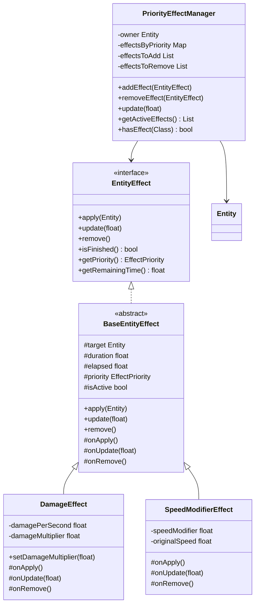

### 2.7 效果优先级图
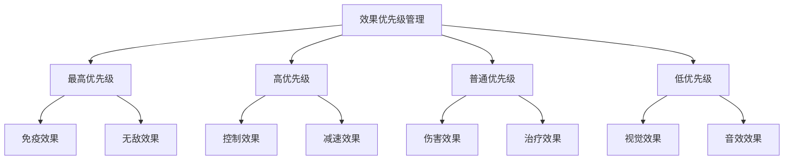

### 2.8 实现注意事项与优化

1. **效果优先级管理**
   - 实现效果优先级系统
   - 处理效果冲突
   - 管理效果叠加

2. **性能优化**
   - 使用效果对象池
   - 优化效果更新逻辑
   - 减少不必要的效果应用

3. **效果数据管理**
   - 合理使用效果参数
   - 确保效果数据的线程安全
   - 实现效果数据的序列化

4. **调试支持**
   - 添加效果状态监控
   - 实现效果可视化工具
   - 支持效果调试模式

5. **扩展性考虑**
   - 支持效果组合
   - 实现效果继承机制
   - 提供效果自定义接口

## 三、代理模式

### 3.1 重构目标
- 实现资源的延迟加载机制
- 优化内存使用，避免不必要的资源加载
- 统一资源访问接口
- 提供资源生命周期管理
- 支持资源缓存和预加载

### 3.2 重构前的问题
- 资源加载时机不合理，占用过多内存
- 缺乏统一的资源管理机制
- 资源加载状态难以追踪
- 资源释放不及时，造成内存泄漏
- 缺乏资源加载错误处理

### 3.3 重构方案

#### 3.3.1 定义资源接口
```java
public interface GameResource {
    void load();
    void unload();
    boolean isLoaded();
    String getResourcePath();
}

public interface ResourceManager {
    void preloadResource(String path);
    GameResource getResource(String path);
    void releaseResource(String path);
    void releaseAll();
}
```

#### 3.3.2 实现资源代理类
```java
public class TextureResourceProxy implements GameResource {
    private TextureResource realResource;
    private String resourcePath;
    private boolean isLoading;
    private List<ResourceLoadListener> loadListeners;

    public TextureResourceProxy(String path) {
        this.resourcePath = path;
        this.loadListeners = new ArrayList<>();
        this.isLoading = false;
    }

    @Override
    public void load() {
        if (realResource == null && !isLoading) {
            isLoading = true;
            try {
                realResource = new TextureResource(resourcePath);
                realResource.load();
                notifyLoadComplete();
            } catch (Exception e) {
                notifyLoadError(e);
            } finally {
                isLoading = false;
            }
        }
    }

    @Override
    public void unload() {
        if (realResource != null) {
            realResource.unload();
            realResource = null;
        }
    }

    @Override
    public boolean isLoaded() {
        return realResource != null && realResource.isLoaded();
    }

    public void addLoadListener(ResourceLoadListener listener) {
        loadListeners.add(listener);
    }

    private void notifyLoadComplete() {
        for (ResourceLoadListener listener : loadListeners) {
            listener.onLoadComplete(this);
        }
    }

    private void notifyLoadError(Exception e) {
        for (ResourceLoadListener listener : loadListeners) {
            listener.onLoadError(this, e);
        }
    }
}
```

#### 3.3.3 资源管理器实现
```java
public class GameResourceManager implements ResourceManager {
    private Map<String, GameResource> resources;
    private Map<String, List<GameResource>> dependencies;
    private ExecutorService loadingExecutor;

    public GameResourceManager() {
        this.resources = new ConcurrentHashMap<>();
        this.dependencies = new ConcurrentHashMap<>();
        this.loadingExecutor = Executors.newFixedThreadPool(2);
    }

    @Override
    public void preloadResource(String path) {
        if (!resources.containsKey(path)) {
            GameResource resource = createResource(path);
            resources.put(path, resource);
            loadingExecutor.submit(() -> resource.load());
        }
    }

    @Override
    public GameResource getResource(String path) {
        GameResource resource = resources.get(path);
        if (resource == null) {
            resource = createResource(path);
            resources.put(path, resource);
            resource.load(); // 同步加载
        }
        return resource;
    }

    @Override
    public void releaseResource(String path) {
        GameResource resource = resources.remove(path);
        if (resource != null) {
            resource.unload();
        }
    }

    private GameResource createResource(String path) {
        // 根据资源类型创建适当的代理
        if (path.endsWith(".png") || path.endsWith(".jpg")) {
            return new TextureResourceProxy(path);
        } else if (path.endsWith(".wav") || path.endsWith(".mp3")) {
            return new AudioResourceProxy(path);
        }
        throw new IllegalArgumentException("Unsupported resource type: " + path);
    }
}
```

### 3.4 重构后的改进
1. **内存优化**: 资源按需加载，及时释放
2. **性能提升**: 支持资源预加载和异步加载
3. **错误处理**: 完善的资源加载错误处理机制
4. **可维护性**: 统一的资源管理接口，便于维护
5. **扩展性**: 易于添加新的资源类型支持

### 3.5 使用示例
```java
// 预加载资源
resourceManager.preloadResource("textures/player.png");

// 获取资源
GameResource resource = resourceManager.getResource("textures/player.png");
if (resource.isLoaded()) {
    // 使用资源
}

// 释放资源
resourceManager.releaseResource("textures/player.png");
```

### 3.6 UML类图
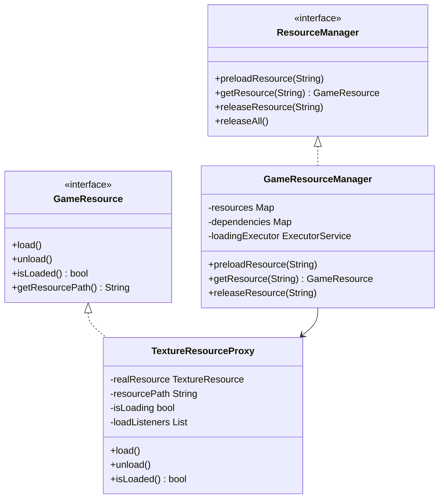

### 3.7 资源加载流程图
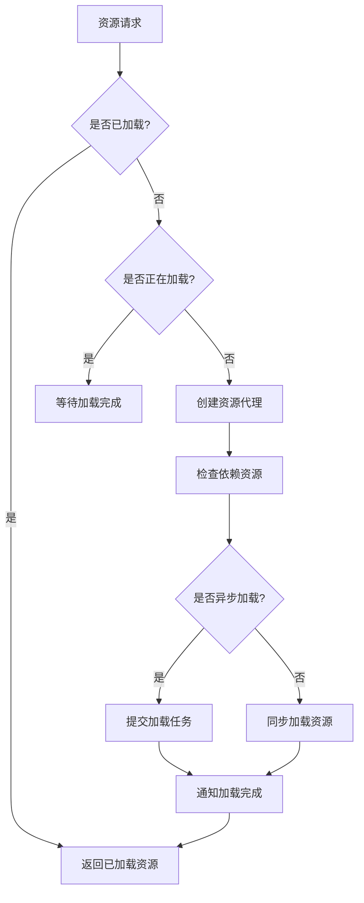

### 3.8 实现注意事项与优化

1. **资源加载策略**
   - 实现资源预加载机制
   ```java
   public class ResourcePreloader {
       private final ResourceManager resourceManager;
       private final Map<String, List<String>> preloadGroups;
       
       public void preloadGroup(String groupName) {
           List<String> resources = preloadGroups.get(groupName);
           if (resources != null) {
               for (String path : resources) {
                   resourceManager.preloadResource(path);
               }
           }
       }
   }
   ```
   
   - 支持资源分组加载
   ```java
   public class ResourceGroup {
       private final String name;
       private final List<String> resourcePaths;
       private final ResourceLoadPriority priority;
       
       public void load() {
           for (String path : resourcePaths) {
               if (priority == ResourceLoadPriority.HIGH) {
                   resourceManager.getResource(path); // 同步加载
               } else {
                   resourceManager.preloadResource(path); // 异步加载
               }
           }
       }
   }
   ```
   
   - 实现资源依赖管理
   ```java
   public class ResourceDependencyManager {
       private final Map<String, Set<String>> dependencies;
       
       public void addDependency(String resource, String dependency) {
           dependencies.computeIfAbsent(resource, k -> new HashSet<>()).add(dependency);
       }
       
       public Set<String> getDependencies(String resource) {
           return dependencies.getOrDefault(resource, Collections.emptySet());
       }
   }
   ```

2. **内存管理优化**
   - 实现资源引用计数
   ```java
   public class ReferenceCountedResource implements GameResource {
       private int referenceCount;
       private final GameResource resource;
       
       public void retain() {
           referenceCount++;
       }
       
       public void release() {
           referenceCount--;
           if (referenceCount <= 0) {
               resource.unload();
           }
       }
   }
   ```
   
   - 自动垃圾回收机制
   ```java
   public class ResourceGarbageCollector {
       private final Map<String, WeakReference<GameResource>> resources;
       private final ReferenceQueue<GameResource> queue;
       
       public void checkGarbage() {
           Reference<?> ref;
           while ((ref = queue.poll()) != null) {
               // 清理未使用的资源
               WeakReference<GameResource> weakRef = (WeakReference<GameResource>) ref;
               resources.remove(weakRef);
           }
       }
   }
   ```
   
   - 资源缓存策略
   ```java
   public class ResourceCache {
       private final int maxSize;
       private final Map<String, GameResource> cache;
       private final LinkedList<String> lruList;
       
       public void put(String path, GameResource resource) {
           if (cache.size() >= maxSize) {
               String oldest = lruList.removeLast();
               cache.remove(oldest);
           }
           cache.put(path, resource);
           lruList.addFirst(path);
       }
   }
   ```

3. **错误处理机制**
   - 资源加载重试机制
   ```java
   public class ResourceLoadRetryHandler {
       private final int maxRetries;
       private final Map<String, Integer> retryCount;
       
       public void handleLoadError(String path, Exception e) {
           int count = retryCount.getOrDefault(path, 0);
           if (count < maxRetries) {
               retryCount.put(path, count + 1);
               // 延迟重试
               scheduleRetry(path, calculateDelay(count));
           } else {
               notifyLoadFailed(path, e);
           }
       }
   }
   ```
   
   - 资源完整性验证
   ```java
   public class ResourceValidator {
       public boolean validateResource(GameResource resource) {
           try {
               // 验证资源完整性
               if (resource instanceof TextureResource) {
                   return validateTexture((TextureResource) resource);
               } else if (resource instanceof AudioResource) {
                   return validateAudio((AudioResource) resource);
               }
               return true;
           } catch (Exception e) {
               return false;
           }
       }
   }
   ```
   
   - 异常恢复机制
   ```java
   public class ResourceRecoveryManager {
       private final Map<String, GameResource> backupResources;
       
       public void backup(String path, GameResource resource) {
           backupResources.put(path, resource.createBackup());
       }
       
       public GameResource recover(String path) {
           return backupResources.get(path);
       }
   }
   ```

4. **性能优化**
   - 资源压缩和解压
   ```java
   public class ResourceCompressor {
       public byte[] compress(byte[] data) {
           // 实现资源压缩
           return compressed;
       }
       
       public byte[] decompress(byte[] compressed) {
           // 实现资源解压
           return original;
       }
   }
   ```
   
   - 异步加载队列
   ```java
   public class AsyncLoadQueue {
       private final PriorityQueue<LoadTask> tasks;
       private final ExecutorService executor;
       
       public void addTask(LoadTask task) {
           tasks.offer(task);
           processNextTask();
       }
       
       private void processNextTask() {
           LoadTask task = tasks.poll();
           if (task != null) {
               executor.submit(task);
           }
       }
   }
   ```
   
   - 资源预处理
   ```java
   public class ResourcePreprocessor {
       public void preprocess(GameResource resource) {
           if (resource instanceof TextureResource) {
               preprocessTexture((TextureResource) resource);
           } else if (resource instanceof AudioResource) {
               preprocessAudio((AudioResource) resource);
           }
       }
   }
   ```

5. **监控和调试**
   - 资源使用统计
   ```java
   public class ResourceUsageMonitor {
       private final Map<String, ResourceStats> stats;
       
       public void recordAccess(String path) {
           ResourceStats stat = stats.computeIfAbsent(path, k -> new ResourceStats());
           stat.incrementAccessCount();
       }
       
       public void recordLoadTime(String path, long time) {
           ResourceStats stat = stats.get(path);
           if (stat != null) {
               stat.addLoadTime(time);
           }
       }
   }
   ```
   
   - 加载性能分析
   ```java
   public class ResourceLoadProfiler {
       private final Map<String, LoadMetrics> metrics;
       
       public void startProfiling(String path) {
           metrics.put(path, new LoadMetrics(System.nanoTime()));
       }
       
       public void endProfiling(String path) {
           LoadMetrics metric = metrics.get(path);
           if (metric != null) {
               metric.setEndTime(System.nanoTime());
               analyzeMetrics(metric);
           }
       }
   }
   ```
   
   - 调试工具支持
   ```java
   public class ResourceDebugger {
       public void dumpResourceInfo(GameResource resource) {
           // 输出资源详细信息
           System.out.println("Resource: " + resource.getResourcePath());
           System.out.println("Status: " + resource.getStatus());
           System.out.println("Memory: " + resource.getMemoryUsage());
       }
   }
   ```

## 四、观察者模式

### 4.1 重构目标
- 实现实体状态变化的自动通知机制
- 降低系统组件间的耦合度
- 支持动态添加和移除观察者
- 实现事件的优先级处理
- 提供灵活的事件分发机制

### 4.2 重构前的问题
- 状态变化通知逻辑分散在各处
- 组件之间存在强耦合
- 事件处理缺乏统一管理
- 难以动态调整事件监听
- 缺乏事件优先级机制

### 4.3 重构方案

#### 4.3.1 定义事件接口和基类
```java
public interface EntityEvent {
    Entity getSource();
    EventType getType();
    long getTimestamp();
}

public abstract class BaseEntityEvent implements EntityEvent {
    protected final Entity source;
    protected final EventType type;
    protected final long timestamp;
    
    public BaseEntityEvent(Entity source, EventType type) {
        this.source = source;
        this.type = type;
        this.timestamp = System.currentTimeMillis();
    }
    
    @Override
    public Entity getSource() {
        return source;
    }
    
    @Override
    public EventType getType() {
        return type;
    }
    
    @Override
    public long getTimestamp() {
        return timestamp;
    }
}
```

#### 4.3.2 实现事件监听器
```java
public interface EntityEventListener {
    void onEvent(EntityEvent event);
    EventType[] getInterestedEvents();
    int getPriority();
}

public class EntityStateListener implements EntityEventListener {
    private final int priority;
    
    public EntityStateListener(int priority) {
        this.priority = priority;
    }
    
    @Override
    public void onEvent(EntityEvent event) {
        if (event instanceof StateChangeEvent) {
            handleStateChange((StateChangeEvent) event);
        }
    }
    
    @Override
    public EventType[] getInterestedEvents() {
        return new EventType[] { EventType.STATE_CHANGE };
    }
    
    @Override
    public int getPriority() {
        return priority;
    }
    
    private void handleStateChange(StateChangeEvent event) {
        Entity entity = event.getSource();
        EntityState oldState = event.getOldState();
        EntityState newState = event.getNewState();
        // 处理状态变化
    }
}
```

#### 4.3.3 事件管理器实现
```java
public class EntityEventManager {
    private final Map<EventType, PriorityQueue<EntityEventListener>> listeners;
    private final Queue<EntityEvent> eventQueue;
    private final ExecutorService eventExecutor;
    
    public EntityEventManager() {
        this.listeners = new EnumMap<>(EventType.class);
        this.eventQueue = new ConcurrentLinkedQueue<>();
        this.eventExecutor = Executors.newSingleThreadExecutor();
        
        for (EventType type : EventType.values()) {
            listeners.put(type, new PriorityQueue<>(
                (l1, l2) -> Integer.compare(l2.getPriority(), l1.getPriority())
            ));
        }
    }
    
    public void addEventListener(EntityEventListener listener) {
        for (EventType type : listener.getInterestedEvents()) {
            listeners.get(type).offer(listener);
        }
    }
    
    public void removeEventListener(EntityEventListener listener) {
        for (EventType type : listener.getInterestedEvents()) {
            listeners.get(type).remove(listener);
        }
    }
    
    public void dispatchEvent(EntityEvent event) {
        eventQueue.offer(event);
        processEvents();
    }
    
    private void processEvents() {
        eventExecutor.submit(() -> {
            EntityEvent event;
            while ((event = eventQueue.poll()) != null) {
                EventType type = event.getType();
                PriorityQueue<EntityEventListener> typeListeners = listeners.get(type);
                
                for (EntityEventListener listener : typeListeners) {
                    try {
                        listener.onEvent(event);
                    } catch (Exception e) {
                        handleEventError(e, event, listener);
                    }
                }
            }
        });
    }
    
    private void handleEventError(Exception e, EntityEvent event, EntityEventListener listener) {
        // 处理事件处理过程中的错误
        System.err.println("Error processing event: " + event.getType() + 
                          " by listener: " + listener.getClass().getName());
        e.printStackTrace();
    }
}
```

### 4.4 重构后的改进
1. **解耦**: 实体状态变化与响应逻辑完全分离
2. **可维护**: 事件处理逻辑集中管理，易于维护
3. **可扩展**: 支持动态添加和移除事件监听器
4. **灵活**: 事件优先级机制确保处理顺序
5. **健壮**: 完善的错误处理机制

### 4.5 使用示例
```java
// 创建事件监听器
EntityEventListener stateListener = new EntityStateListener(Priority.HIGH);
EntityEventListener effectListener = new EntityEffectListener(Priority.NORMAL);

// 注册监听器
eventManager.addEventListener(stateListener);
eventManager.addEventListener(effectListener);

// 触发事件
Entity entity = new PlayerEntity();
StateChangeEvent event = new StateChangeEvent(
    entity, 
    EntityState.IDLE, 
    EntityState.MOVING
);
eventManager.dispatchEvent(event);
```

### 4.6 UML类图
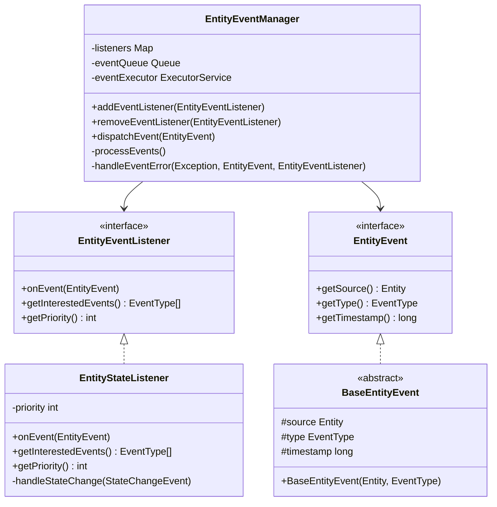

### 4.7 事件处理流程图
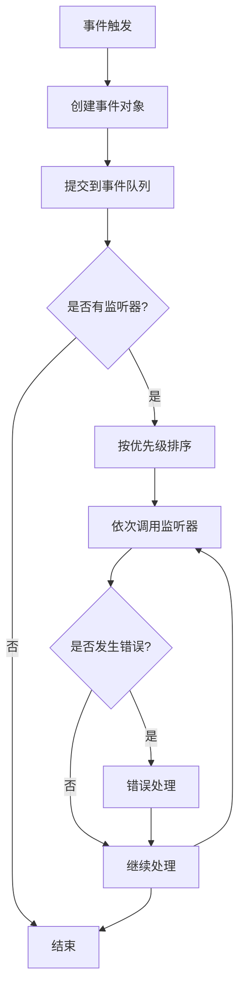

### 4.8 实现注意事项与优化

1. **事件优先级管理**
   - 实现事件优先级系统
   ```java
   public enum EventPriority {
       HIGHEST(1000),
       HIGH(800),
       NORMAL(500),
       LOW(200),
       LOWEST(0);
       
       private final int value;
       
       EventPriority(int value) {
           this.value = value;
       }
       
       public int getValue() {
           return value;
       }
   }
   ```
   
   - 优先级队列实现
   ```java
   public class PriorityEventQueue {
       private final PriorityQueue<QueuedEvent> queue;
       
       public PriorityEventQueue() {
           this.queue = new PriorityQueue<>((e1, e2) -> 
               Integer.compare(e2.getPriority(), e1.getPriority())
           );
       }
       
       public void enqueue(EntityEvent event, int priority) {
           queue.offer(new QueuedEvent(event, priority));
       }
       
       public EntityEvent dequeue() {
           QueuedEvent event = queue.poll();
           return event != null ? event.getEvent() : null;
       }
   }
   ```

2. **事件过滤和分发**
   - 事件过滤器实现
   ```java
   public interface EventFilter {
       boolean shouldProcess(EntityEvent event);
   }
   
   public class CompositeEventFilter implements EventFilter {
       private final List<EventFilter> filters;
       
       public boolean shouldProcess(EntityEvent event) {
           return filters.stream()
                   .allMatch(filter -> filter.shouldProcess(event));
       }
   }
   ```
   
   - 事件分发器优化
   ```java
   public class EventDispatcher {
       private final Map<Class<? extends EntityEvent>, List<EventFilter>> filters;
       
       public void dispatch(EntityEvent event) {
           Class<? extends EntityEvent> eventType = event.getClass();
           List<EventFilter> typeFilters = filters.get(eventType);
           
           if (typeFilters != null && typeFilters.stream()
                   .allMatch(filter -> filter.shouldProcess(event))) {
               processEvent(event);
           }
       }
   }
   ```

3. **性能优化**
   - 事件对象池
   ```java
   public class EventPool<T extends EntityEvent> {
       private final Queue<T> pool;
       private final Supplier<T> factory;
       
       public T obtain() {
           T event = pool.poll();
           return event != null ? event : factory.get();
       }
       
       public void recycle(T event) {
           // 重置事件状态
           event.reset();
           pool.offer(event);
       }
   }
   ```
   
   - 批量事件处理
   ```java
   public class BatchEventProcessor {
       private final int batchSize;
       private final List<EntityEvent> batch;
       
       public void processBatch() {
           if (batch.size() >= batchSize) {
               batch.forEach(this::processEvent);
               batch.clear();
           }
       }
   }
   ```
   
   - 异步事件处理
   ```java
   public class AsyncEventProcessor {
       private final ExecutorService executor;
       private final BlockingQueue<EntityEvent> eventQueue;
       
       public void start() {
           executor.submit(() -> {
               while (!Thread.interrupted()) {
                   EntityEvent event = eventQueue.take();
                   processEvent(event);
               }
           });
       }
   }
   ```

4. **监控和调试**
   - 事件统计
   ```java
   public class EventStatistics {
       private final Map<EventType, AtomicInteger> eventCounts;
       private final Map<EventType, AtomicLong> processingTimes;
       
       public void recordEvent(EntityEvent event, long processingTime) {
           EventType type = event.getType();
           eventCounts.get(type).incrementAndGet();
           processingTimes.get(type).addAndGet(processingTime);
       }
       
       public void printStats() {
           // 输出统计信息
       }
   }
   ```
   
   - 事件日志
   ```java
   public class EventLogger {
       private final Queue<EventLogEntry> eventLog;
       private final int maxLogSize;
       
       public void logEvent(EntityEvent event) {
           if (eventLog.size() >= maxLogSize) {
               eventLog.poll();
           }
           eventLog.offer(new EventLogEntry(event));
       }
       
       public void dumpLog() {
           // 输出事件日志
       }
   }
   ```
   
   - 性能分析
   ```java
   public class EventProfiler {
       private final Map<EventType, PerformanceMetrics> metrics;
       
       public void startProfiling(EntityEvent event) {
           EventType type = event.getType();
           metrics.computeIfAbsent(type, k -> new PerformanceMetrics())
                 .startMeasurement();
       }
       
       public void endProfiling(EntityEvent event) {
           EventType type = event.getType();
           metrics.get(type).endMeasurement();
       }
   }
   ```

5. **错误处理**
   - 异常处理策略
   ```java
   public class EventErrorHandler {
       private final Map<Class<? extends Exception>, ErrorStrategy> strategies;
       
       public void handleError(Exception e, EntityEvent event) {
           ErrorStrategy strategy = strategies.get(e.getClass());
           if (strategy != null) {
               strategy.handle(e, event);
           } else {
               defaultStrategy.handle(e, event);
           }
       }
   }
   ```
   
   - 重试机制
   ```java
   public class EventRetryHandler {
       private final int maxRetries;
       private final Map<EntityEvent, Integer> retryCount;
       
       public void retry(EntityEvent event) {
           int count = retryCount.getOrDefault(event, 0);
           if (count < maxRetries) {
               retryCount.put(event, count + 1);
               scheduleRetry(event, calculateDelay(count));
           } else {
               handleMaxRetriesExceeded(event);
           }
       }
   }
   ```
   
   - 事件恢复
   ```java
   public class EventRecoveryManager {
       private final Map<String, EntityEvent> eventBackups;
       
       public void backup(EntityEvent event) {
           String eventId = generateEventId(event);
           eventBackups.put(eventId, event.clone());
       }
       
       public EntityEvent recover(String eventId) {
           return eventBackups.get(eventId);
       }
   }
   ```

## 五、状态模式

### 5.1 重构目标
- 实现实体状态的灵活管理和转换
- 将状态相关的行为封装到独立的类中
- 支持状态的嵌套和组合
- 提供状态转换的验证机制
- 实现状态历史记录和回退功能

### 5.2 重构前的问题
- 状态逻辑与实体类强耦合
- 状态转换逻辑复杂且难以维护
- 状态行为分散在各处
- 难以添加新状态
- 缺乏状态转换的验证机制

### 5.3 重构方案

#### 5.3.1 定义状态接口和基类
```java
public interface EntityState {
    void enter(Entity entity);
    void update(Entity entity, float delta);
    void exit(Entity entity);
    boolean canEnter(Entity entity);
    boolean canExit(Entity entity);
}

public abstract class BaseEntityState implements EntityState {
    protected StateType type;
    protected Map<String, Object> stateData;
    
    public BaseEntityState(StateType type) {
        this.type = type;
        this.stateData = new HashMap<>();
    }
    
    @Override
    public void enter(Entity entity) {
        // 基础进入逻辑
    }
    
    @Override
    public void exit(Entity entity) {
        // 基础退出逻辑
    }
    
    @Override
    public boolean canEnter(Entity entity) {
        return true;  // 默认允许进入
    }
    
    @Override
    public boolean canExit(Entity entity) {
        return true;  // 默认允许退出
    }
}
```

#### 5.3.2 实现具体状态类
```java
public class IdleState extends BaseEntityState {
    public IdleState() {
        super(StateType.IDLE);
    }
    
    @Override
    public void enter(Entity entity) {
        super.enter(entity);
        // 停止移动
        entity.setVelocity(Vector2.Zero);
        // 播放待机动画
        entity.playAnimation("idle");
    }
    
    @Override
    public void update(Entity entity, float delta) {
        // 检查是否有输入
        if (entity.hasMovementInput()) {
            entity.changeState(StateType.MOVING);
        }
        // 检查是否受到攻击
        if (entity.isUnderAttack()) {
            entity.changeState(StateType.COMBAT);
        }
    }
}

public class CombatState extends BaseEntityState {
    private float combatTimer;
    private float exitCombatDelay = 5.0f;
    
    public CombatState() {
        super(StateType.COMBAT);
    }
    
    @Override
    public void enter(Entity entity) {
        super.enter(entity);
        combatTimer = 0;
        // 进入战斗姿态
        entity.setInCombat(true);
        // 播放战斗待机动画
        entity.playAnimation("combat_idle");
    }
    
    @Override
    public void update(Entity entity, float delta) {
        combatTimer += delta;
        
        // 检查是否可以退出战斗
        if (combatTimer >= exitCombatDelay && !entity.hasEnemiesNearby()) {
            entity.changeState(StateType.IDLE);
        }
        
        // 处理战斗逻辑
        if (entity.canAttack()) {
            entity.performAttack();
        }
    }
    
    @Override
    public void exit(Entity entity) {
        super.exit(entity);
        entity.setInCombat(false);
    }
}

public class StunnedState extends BaseEntityState {
    private float duration;
    private float remainingTime;
    
    public StunnedState(float duration) {
        super(StateType.STUNNED);
        this.duration = duration;
    }
    
    @Override
    public void enter(Entity entity) {
        super.enter(entity);
        remainingTime = duration;
        // 停止当前动作
        entity.stopCurrentAction();
        // 播放眩晕动画
        entity.playAnimation("stunned");
    }
    
    @Override
    public void update(Entity entity, float delta) {
        remainingTime -= delta;
        if (remainingTime <= 0) {
            // 眩晕结束，返回之前的状态
            entity.revertToPreviousState();
        }
    }
    
    @Override
    public boolean canEnter(Entity entity) {
        // 检查是否可以被眩晕
        return !entity.isImmuneToStun();
    }
}
```

#### 5.3.3 状态机实现
```java
public class EntityStateMachine {
    private Entity owner;
    private Map<StateType, EntityState> states;
    private EntityState currentState;
    private EntityState previousState;
    private Stack<EntityState> stateStack;
    
    public EntityStateMachine(Entity owner) {
        this.owner = owner;
        this.states = new HashMap<>();
        this.stateStack = new Stack<>();
        initializeStates();
    }
    
    private void initializeStates() {
        // 注册默认状态
        registerState(new IdleState());
        registerState(new MovingState());
        registerState(new CombatState());
        registerState(new StunnedState(2.0f));
    }
    
    public void registerState(EntityState state) {
        states.put(state.getType(), state);
    }
    
    public void changeState(StateType newStateType) {
        EntityState newState = states.get(newStateType);
        if (newState != null && newState != currentState) {
            // 检查状态转换是否有效
            if (currentState != null) {
                if (!currentState.canExit(owner)) {
                    return;  // 当前状态不能退出
                }
            }
            if (!newState.canEnter(owner)) {
                return;  // 新状态不能进入
            }
            
            // 执行状态转换
            if (currentState != null) {
                currentState.exit(owner);
            }
            previousState = currentState;
            currentState = newState;
            currentState.enter(owner);
            
            // 触发状态改变事件
            owner.getEventManager().dispatchEvent(
                new StateChangeEvent(owner, previousState, currentState)
            );
        }
    }
    
    public void pushState(StateType stateType) {
        EntityState newState = states.get(stateType);
        if (newState != null && newState != currentState) {
            if (currentState != null) {
                stateStack.push(currentState);
                currentState.exit(owner);
            }
            currentState = newState;
            currentState.enter(owner);
        }
    }
    
    public void popState() {
        if (!stateStack.isEmpty()) {
            if (currentState != null) {
                currentState.exit(owner);
            }
            currentState = stateStack.pop();
            currentState.enter(owner);
        }
    }
    
    public void revertToPreviousState() {
        if (previousState != null) {
            changeState(previousState.getType());
        }
    }
    
    public void update(float delta) {
        if (currentState != null) {
            currentState.update(owner, delta);
        }
    }
    
    public EntityState getCurrentState() {
        return currentState;
    }
    
    public boolean isInState(StateType stateType) {
        return currentState != null && currentState.getType() == stateType;
    }
}
```

### 5.4 重构后的改进
1. **解耦**: 状态逻辑与实体类完全分离
2. **可维护**: 每个状态独立封装，易于修改和测试
3. **可扩展**: 添加新状态只需实现状态接口
4. **灵活**: 支持状态的嵌套和组合
5. **健壮**: 提供状态转换验证机制

### 5.5 使用示例
```java
// 创建状态机
EntityStateMachine stateMachine = new EntityStateMachine(entity);

// 注册自定义状态
stateMachine.registerState(new CustomState());

// 状态转换
stateMachine.changeState(StateType.COMBAT);

// 临时状态
stateMachine.pushState(StateType.STUNNED);
// ... 眩晕结束后
stateMachine.popState();

// 在实体更新循环中
stateMachine.update(deltaTime);
```

### 5.6 UML类图
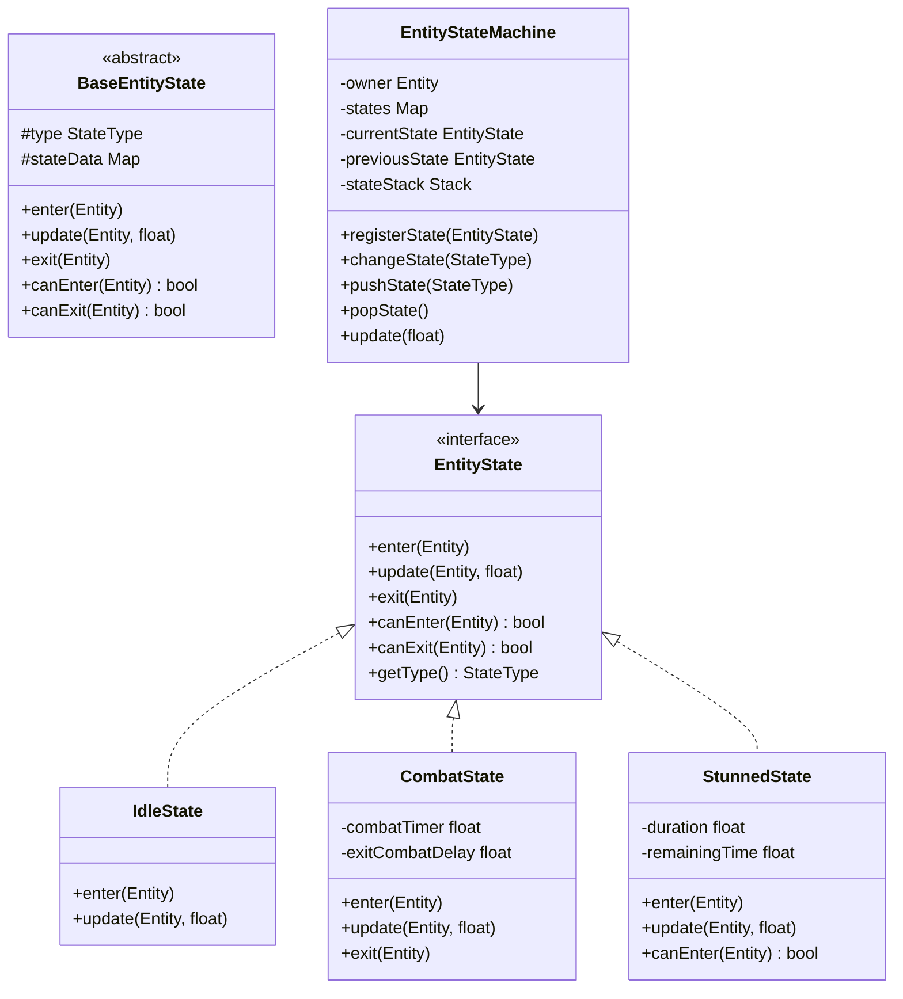

### 5.7 状态转换图
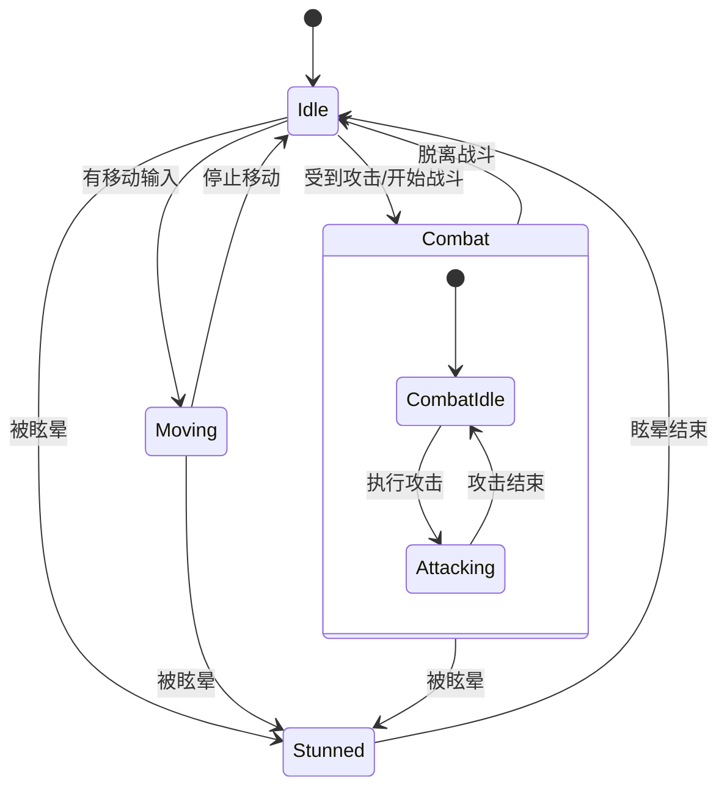

### 5.8 实现注意事项与优化

1. **状态转换验证**
   - 实现状态转换前置条件检查
   - 处理无效状态转换
   - 记录状态转换日志

2. **性能优化**
   - 使用状态对象池
   - 优化状态更新逻辑
   - 减少不必要的状态切换

3. **状态数据管理**
   - 合理使用状态数据
   - 确保状态数据的线程安全
   - 实现状态数据的序列化

4. **调试支持**
   - 添加状态转换调试信息
   - 实现状态可视化工具
   - 支持状态回放功能

5. **扩展性考虑**
   - 支持状态组合
   - 实现状态继承机制
   - 提供状态自定义接口

## 六、组合实体模式

### 6.1 重构目标
- 实现灵活的实体组件系统
- 支持组件的动态添加和移除
- 提供组件间的通信机制
- 实现组件的生命周期管理
- 支持组件的依赖关系处理

### 6.2 重构前的问题
- 实体功能通过继承实现，导致类层次复杂
- 组件之间耦合度高
- 难以复用和组合功能
- 缺乏统一的组件管理机制
- 组件间通信方式不统一

### 6.3 重构方案

#### 6.3.1 定义组件接口和消息系统
```java
public interface Component {
    void initialize(Entity owner);
    void update(float delta);
    void dispose();
    boolean handleMessage(ComponentMessage message);
}

public class ComponentMessage {
    private String type;
    private Map<String, Object> parameters;

    public ComponentMessage(String type) {
        this.type = type;
        this.parameters = new HashMap<>();
    }

    public void setParameter(String key, Object value) {
        parameters.put(key, value);
    }

    public Object getParameter(String key) {
        return parameters.get(key);
    }
}
```

#### 6.3.2 实现组合实体
```java
public class CompositeEntity implements Entity {
    private Map<Class<? extends Component>, Component> components;
    private List<Component> updateOrder;
    private boolean initialized;
    private EntityManager entityManager;

    public CompositeEntity(EntityManager entityManager) {
        this.components = new HashMap<>();
        this.updateOrder = new ArrayList<>();
        this.initialized = false;
        this.entityManager = entityManager;
    }

    public <T extends Component> void addComponent(T component) {
        Class<? extends Component> componentClass = component.getClass();
        if (!components.containsKey(componentClass)) {
            components.put(componentClass, component);
            updateOrder.add(component);
            if (initialized) {
                component.initialize(this);
            }
        }
    }

    public <T extends Component> T getComponent(Class<T> componentClass) {
        return componentClass.cast(components.get(componentClass));
    }

    public void initialize() {
        if (!initialized) {
            for (Component component : updateOrder) {
                component.initialize(this);
            }
            initialized = true;
        }
    }

    public void update(float delta) {
        for (Component component : updateOrder) {
            component.update(delta);
        }
    }

    public void dispose() {
        for (Component component : updateOrder) {
            component.dispose();
        }
        components.clear();
        updateOrder.clear();
    }

    public boolean sendMessage(ComponentMessage message) {
        boolean handled = false;
        for (Component component : updateOrder) {
            if (component.handleMessage(message)) {
                handled = true;
            }
        }
        return handled;
    }
}
```

#### 6.3.3 实现具体组件
```java
public class HealthComponent implements Component {
    private Entity owner;
    private float maxHealth;
    private float currentHealth;
    private List<StatusEffect> statusEffects;

    @Override
    public void initialize(Entity owner) {
        this.owner = owner;
        this.statusEffects = new ArrayList<>();
    }

    @Override
    public void update(float delta) {
        updateStatusEffects(delta);
    }

    @Override
    public boolean handleMessage(ComponentMessage message) {
        switch (message.getType()) {
            case "DAMAGE":
                float damage = (float) message.getParameter("amount");
                takeDamage(damage);
                return true;
            case "HEAL":
                float healing = (float) message.getParameter("amount");
                heal(healing);
                return true;
            default:
                return false;
        }
    }
}

public class MovementComponent implements Component {
    private Entity owner;
    private Vector2 position;
    private Vector2 velocity;
    private float maxSpeed;

    @Override
    public void update(float delta) {
        updatePosition(delta);
        handleCollisions();
    }

    @Override
    public boolean handleMessage(ComponentMessage message) {
        switch (message.getType()) {
            case "MOVE":
                Vector2 direction = (Vector2) message.getParameter("direction");
                move(direction);
                return true;
            case "TELEPORT":
                Vector2 position = (Vector2) message.getParameter("position");
                teleport(position);
                return true;
            default:
                return false;
        }
    }
}
```

### 6.4 重构后的改进
1. **灵活性**: 通过组合而非继承实现功能
2. **可重用**: 组件可以在不同实体间复用
3. **可维护**: 每个组件职责单一，易于维护
4. **可扩展**: 易于添加新组件和功能
5. **解耦**: 组件之间通过消息系统通信，降低耦合

### 6.5 使用示例
```java
// 创建实体
CompositeEntity player = new CompositeEntity(entityManager);

// 添加组件
player.addComponent(new HealthComponent());
player.addComponent(new MovementComponent());
player.addComponent(new CombatComponent());

// 初始化实体
player.initialize();

// 发送消息给组件
ComponentMessage damageMsg = new ComponentMessage("DAMAGE");
damageMsg.setParameter("amount", 10.0f);
player.sendMessage(damageMsg);
```

### 6.6 UML类图
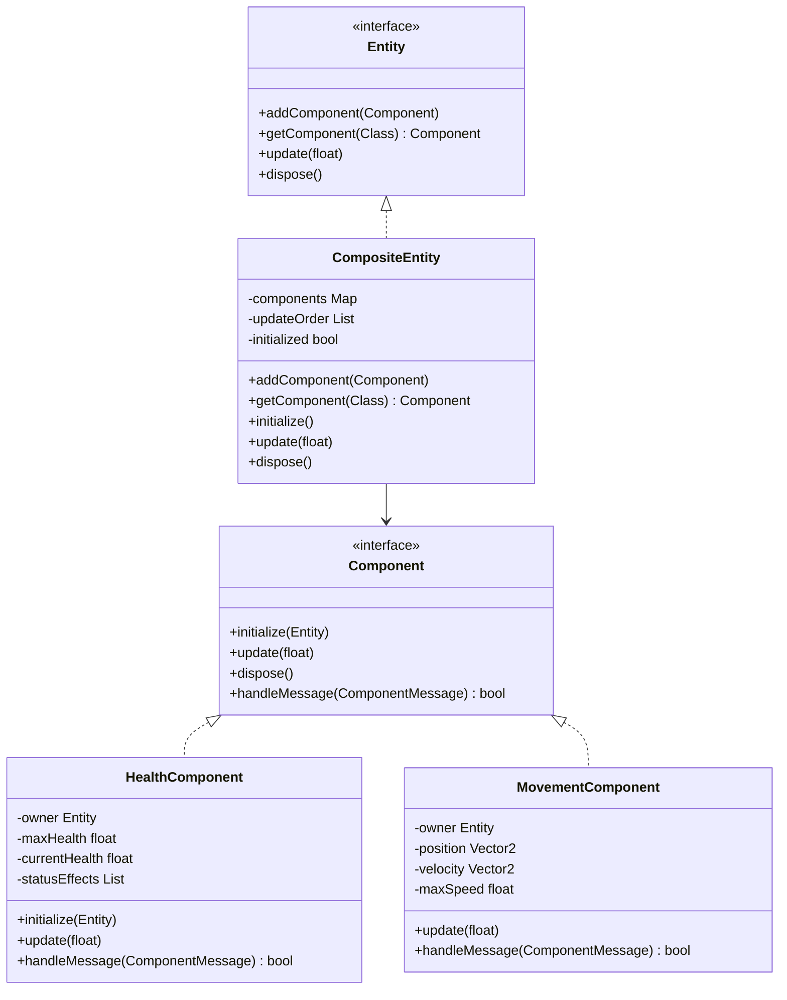

## 七、设计模式之间的协作

### 7.1 协作关系
这六个设计模式共同工作，形成了一个灵活且可扩展的游戏实体系统：

1. **抽象工厂模式**负责创建不同类型的实体
2. **装饰器模式**负责动态添加临时效果
3. **代理模式**确保资源按需加载
4. **观察者模式**实现状态变化的自动通知
5. **状态模式**管理实体的状态转换
6. **组合实体模式**提供灵活的实体构建方式

### 7.2 优点
1. 高度模块化
2. 易于扩展
3. 代码复用
4. 低耦合度
5. 清晰的职责划分

### 7.3 注意事项
1. 合理使用消息系统进行组件间通信
2. 注意资源的及时释放
3. 避免组件之间的循环依赖
4. 保持组件的独立性
5. 注意状态转换的性能开销
6. 控制装饰器链的长度 

### 7.4 设计模式交互图
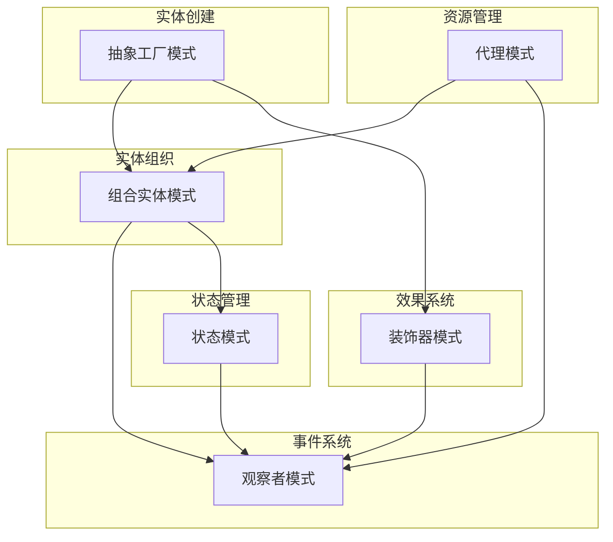

### 7.5 具体协作场景示例

#### 7.5.1 玩家角色创建与状态变化
```java
// 1. 使用抽象工厂创建玩家实体
Entity player = EntityFactory.getInstance().getEntity(EntityType.PLAYER);

// 2. 通过组合模式添加组件
player.addComponent(new HealthComponent());
player.addComponent(new CombatComponent());

// 3. 使用观察者模式监听状态
player.getEventManager().addObserver(EventType.STATE_CHANGED, (event) -> {
    // 处理状态变化
    updatePlayerUI(event);
});

// 4. 使用状态模式管理玩家状态
player.getStateMachine().changeState("combat");

// 5. 使用装饰器模式添加临时效果
player.getEffectManager().addEffect(new PowerUpEffect(30.0f));
```

#### 7.5.2 资源加载与状态管理
```java
// 1. 使用代理模式延迟加载资源
TextureResourceProxy texture = new TextureResourceProxy("player.png");
texture.addLoadListener(new ResourceLoadListener() {
    @Override
    public void onLoadComplete(GameResource resource) {
        // 2. 使用观察者模式通知加载完成
        eventManager.dispatchEvent(new ResourceLoadEvent(resource));
    }
});

// 3. 状态模式处理加载状态
gameStateMachine.changeState("loading");
// 资源加载完成后
gameStateMachine.changeState("playing");
```

### 7.6 模式交互时序图

#### 7.6.1 战斗系统时序图
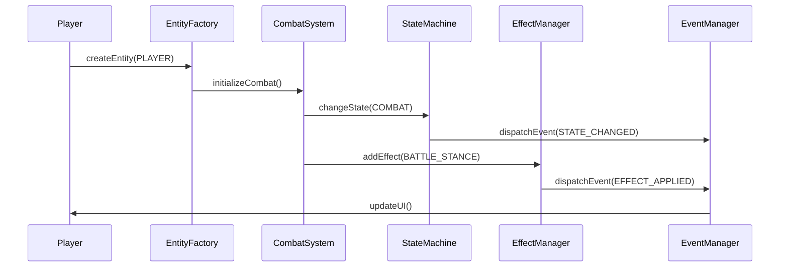

#### 7.6.2 资源加载时序图
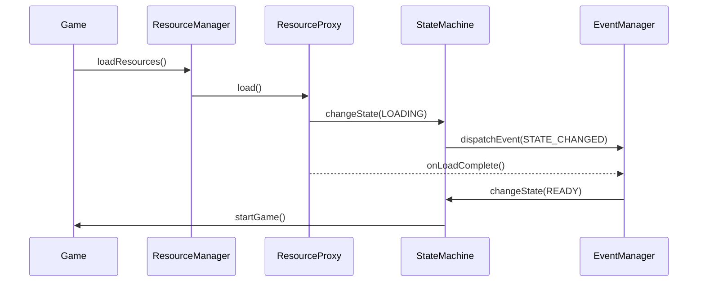

### 7.7 性能优化建议

#### 7.7.1 模式组合性能考虑
1. **事件系统优化**
   - 使用事件对象池减少垃圾回收
   - 实现事件批处理机制
   - 优化事件分发算法
```java
public class EventPool {
    private static final int MAX_POOL_SIZE = 100;
    private Queue<EntityEvent> eventPool;
    
    public EntityEvent obtain(EventType type) {
        EntityEvent event = eventPool.poll();
        return event != null ? event : new EntityEvent(type);
    }
    
    public void free(EntityEvent event) {
        if (eventPool.size() < MAX_POOL_SIZE) {
            event.reset();
            eventPool.offer(event);
        }
    }
}
```

2. **状态转换优化**
   - 缓存常用状态对象
   - 优化状态检查逻辑
   - 减少不必要的状态切换
```java
public class StateCache {
    private Map<String, EntityState> stateCache;
    
    public EntityState getState(String stateName) {
        return stateCache.computeIfAbsent(stateName, 
            name -> createState(name));
    }
}
```

3. **组件系统优化**
   - 实现组件更新排序
   - 使用组件对象池
   - 优化组件消息传递
```java
public class ComponentUpdateManager {
    private List<List<Component>> updateLayers;
    
    public void updateComponents(float delta) {
        for (List<Component> layer : updateLayers) {
            for (Component component : layer) {
                component.update(delta);
            }
        }
    }
}
```

#### 7.7.2 资源管理优化
1. **预加载策略**
   - 场景切换时预加载资源
   - 实现资源分级加载
   - 优化资源缓存策略
```java
public class ResourcePreloader {
    public void preloadScene(String sceneName) {
        List<String> resources = getSceneResources(sceneName);
        for (String resource : resources) {
            resourceManager.preload(resource, getPriority(resource));
        }
    }
}
```

2. **内存管理**
   - 实现资源引用计数
   ```java
   public class ReferenceCountedResource implements GameResource {
       private int referenceCount;
       private final GameResource resource;
       
       public void retain() {
           referenceCount++;
       }
       
       public void release() {
           referenceCount--;
           if (referenceCount <= 0) {
               resource.unload();
           }
       }
   }
   ```
   
   - 自动垃圾回收机制
   ```java
   public class ResourceGarbageCollector {
       private final Map<String, WeakReference<GameResource>> resources;
       private final ReferenceQueue<GameResource> queue;
       
       public void checkGarbage() {
           Reference<?> ref;
           while ((ref = queue.poll()) != null) {
               // 清理未使用的资源
               WeakReference<GameResource> weakRef = (WeakReference<GameResource>) ref;
               resources.remove(weakRef);
           }
       }
   }
   ```
   
   - 资源缓存策略
   ```java
   public class ResourceCache {
       private final int maxSize;
       private final Map<String, GameResource> cache;
       private final LinkedList<String> lruList;
       
       public void put(String path, GameResource resource) {
           if (cache.size() >= maxSize) {
               String oldest = lruList.removeLast();
               cache.remove(oldest);
           }
           cache.put(path, resource);
           lruList.addFirst(path);
       }
   }
   ```

3. **错误处理机制**
   - 资源加载重试机制
   ```java
   public class ResourceLoadRetryHandler {
       private final int maxRetries;
       private final Map<String, Integer> retryCount;
       
       public void handleLoadError(String path, Exception e) {
           int count = retryCount.getOrDefault(path, 0);
           if (count < maxRetries) {
               retryCount.put(path, count + 1);
               // 延迟重试
               scheduleRetry(path, calculateDelay(count));
           } else {
               notifyLoadFailed(path, e);
           }
       }
   }
   ```
   
   - 资源完整性验证
   ```java
   public class ResourceValidator {
       public boolean validateResource(GameResource resource) {
           try {
               // 验证资源完整性
               if (resource instanceof TextureResource) {
                   return validateTexture((TextureResource) resource);
               } else if (resource instanceof AudioResource) {
                   return validateAudio((AudioResource) resource);
               }
               return true;
           } catch (Exception e) {
               return false;
           }
       }
   }
   ```
   
   - 异常恢复机制
   ```java
   public class ResourceRecoveryManager {
       private final Map<String, GameResource> backupResources;
       
       public void backup(String path, GameResource resource) {
           backupResources.put(path, resource.createBackup());
       }
       
       public GameResource recover(String path) {
           return backupResources.get(path);
       }
   }
   ```

4. **性能优化**
   - 资源压缩和解压
   ```java
   public class ResourceCompressor {
       public byte[] compress(byte[] data) {
           // 实现资源压缩
           return compressed;
       }
       
       public byte[] decompress(byte[] compressed) {
           // 实现资源解压
           return original;
       }
   }
   ```
   
   - 异步加载队列
   ```java
   public class AsyncLoadQueue {
       private final PriorityQueue<LoadTask> tasks;
       private final ExecutorService executor;
       
       public void addTask(LoadTask task) {
           tasks.offer(task);
           processNextTask();
       }
       
       private void processNextTask() {
           LoadTask task = tasks.poll();
           if (task != null) {
               executor.submit(task);
           }
       }
   }
   ```
   
   - 资源预处理
   ```java
   public class ResourcePreprocessor {
       public void preprocess(GameResource resource) {
           if (resource instanceof TextureResource) {
               preprocessTexture((TextureResource) resource);
           } else if (resource instanceof AudioResource) {
               preprocessAudio((AudioResource) resource);
           }
       }
   }
   ```

5. **监控和调试**
   - 资源使用统计
   ```java
   public class ResourceUsageMonitor {
       private final Map<String, ResourceStats> stats;
       
       public void recordAccess(String path) {
           ResourceStats stat = stats.computeIfAbsent(path, k -> new ResourceStats());
           stat.incrementAccessCount();
       }
       
       public void recordLoadTime(String path, long time) {
           ResourceStats stat = stats.get(path);
           if (stat != null) {
               stat.addLoadTime(time);
           }
       }
   }
   ```
   
   - 加载性能分析
   ```java
   public class ResourceLoadProfiler {
       private final Map<String, LoadMetrics> metrics;
       
       public void startProfiling(String path) {
           metrics.put(path, new LoadMetrics(System.nanoTime()));
       }
       
       public void endProfiling(String path) {
           LoadMetrics metric = metrics.get(path);
           if (metric != null) {
               metric.setEndTime(System.nanoTime());
               analyzeMetrics(metric);
           }
       }
   }
   ```
   
   - 调试工具支持
   ```java
   public class ResourceDebugger {
       public void dumpResourceInfo(GameResource resource) {
           // 输出资源详细信息
           System.out.println("Resource: " + resource.getResourcePath());
           System.out.println("Status: " + resource.getStatus());
           System.out.println("Memory: " + resource.getMemoryUsage());
       }
   }
   ```

### 7.8 模式协作最佳实践

1. **模式选择原则**
   - 根据实际需求选择合适的模式组合
   - 避免过度设计
   - 保持模式使用的一致性

2. **协作规范**
   - 定义清晰的模式交互接口
   - 维护模式之间的依赖关系
   - 确保模式交互的可测试性

3. **扩展建议**
   - 预留模式扩展点
   - 制定模式版本升级策略
   - 保持文档的同步更新

